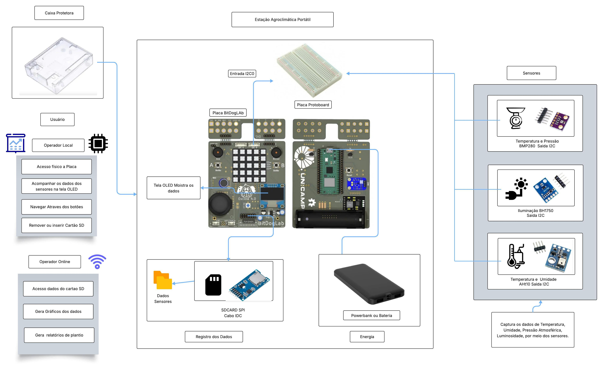

# 🌾 ** Estação Agroclimática Portátil**  

**Institution**: Instittuto Hardware BR-DF  
**Course**: Residência tecnologica em sistemas embarcados
**Authors**: **Rafael Florentino Barbosa**  
**Location**: Brasília-DF  
**Date**: Julho de 2025  

---

## 🎯 **Sobre este Repositório**  
Este repositório contém o desenvolvimento da **Estação Agroclimática Portátil **, uma mini-estação portátil e inteligente projetada para monitorar as condições climáticas na área de pequenas plantações para agricultura familiar, incorporando sistemas eletrônicos embarcados e princípios de IoT (Internet das Coisas). O projeto se concentra no monitoramento em tempo real de parâmetros críticos, como temperatura, umidade, exposição à luz e pressão atmosferica, ao longo do tempo, possibilitando análises sazonais e tomadas de decisão mais precisas para a agricultura,qias tipos de cultura e epoca do ano melhor plantar.

---

## 🛠️ **Visão geral do projeto**  

### **Descrição do problema**  
Produtores rurais de pequeno porte geralmente não têm acesso a dados meteorológicos locais precisos e contínuos. Essa limitação compromete o planejamento agrícola, principalmente em relação ao plantio, irrigação e colheita. Uma solução portátil e de baixo custo para coleta e visualização de dados ambientais pode trazer benefícios diretos ao desempenho e sustentabilidade da produção. 

### ⚙️ **Objetivo da Solução**  
Desenvolver uma mini-estação portátil e inteligente que:
- Monitore  **temperatura, humidade, luz e pressão** em tempo real.  
- Emita  **Na tela OLED** os dados coletados dos sesnores.  
- Armazene **No cartão SD** todos os dados coletados pelos sensores durante o ano para futura analize.  

---

## ✅ **Requisitos Funcionais (RF)**  

| Code | Functional Requirement |  
|------|------------------------|  
| RF01 | Coletar os Dados de Temperatura. |  
| RF02 | Coletar os Dados de Pressão. |  
| RF03 | Coletar os Dados de Umidade . |  
| RF04 | Coletar os Dados de Luminosidade. |  
| RF05 | Exibe dados dos sensores em uma tela. |  
| RF06 | Armazenar os dados coletados no Cartão SD em intervalos de tempo. |  
| RF07 | Mostrar o Status de Armazenamento, se gravou ou não. |  

---

## 🚫 **Requisitos não Funcionais **  

| Code | Non-Functional Requirement |  
|------|---------------------------|  
| RNF01 | Interface amigável para o usuario na tela Oled. |  
| RNF02 | Sensores de alta precisão com tempo de resposta rápido. |  
| RNF03 | Fixação segura dos componentes |  
| RNF04 | Baixo consumo de energia. |  
| RNF05 | O código deve ser modular. |  
| RNF06 | O sistema deve operar continuamente. | 

---

## 📦 **Lista de MAteriais**  

### 🧾 Tabela 3 - Lista de Materiais 
| Item | Quantidade | Descrição |
|------|------------|-----------|
| Caixa de plástico ou madeira | 1 | Recipiente base para proteção dos componentes |
| Placa BitDogLab com Raspberry Pi Pico W | 1 | Microcontrolador com periféricos integrados (OLED, botões) |
| Placa Protoboard | 1 | conectada a entrada I2C0  |
| Sensor de Temperatura e Pressão BMP280 | 1 | Sensor externo conectado via Placa Protoboard|
| Sensor de Umidade e Temperatura AHT10 | 1 | Sensor externo conectado via Placa Protoboard |
| Sensor de Luminosidade BH1750 | 1 | Sensor externo conectado via Placa Protoboard |
| Placa para SDCARD SPI | 1 | Módulo externo conectado via conector IDC direto |
| Cabos customizados XH I2C | 1 | Para conexão do sensore externos à BitDogLab |
| Cabos jumper macho/femea | 4 | Para conexão da protoboard na entrada i2c0 da BitDogLab |
| Cabos jumper macho/femea | 12 | Para conexão dos sensores na protoboard sensores externos à BitDogLab |
| Fonte de energia (power bank ou bateria Li-ion) | 1 | Alimentação portátil para o sistema |

---

## **Estrutura do Projeto**  

### **Principais Características**  
✅ **Monitoramento em Tempo Real**: Sensores monitoram temperatura, umidade, luz e pressão atmosférica.  
✅ **Tela de informações**: Tela Oled com as informações dos sensores.  
✅ **Registro de Dados**: Armazena os dados em um cartão SD ou transmite dados para supervisão remota(Wi-fi).  
✅ **Operação Autônoma**: Alimentado por bateria ou Powerbank para portabilidade.  

### **Fluxo de Trabalho do Sistema**  
1. **Sensores** Coletam dados ambientais.  
2. **BitDogLab (RP2040)** Processa dados e salva no Cartão SD.  
3. **Display OLED** Mostra na tela os dados dos sensores.  
4. **Conectividade Wi-Fi** (opcional) Será implementada no futuro.  

---

## 📷 **Imagens e Esquemas**  

### **Diagrama do Protótipo**  

---

## **Referências**  

- **Embrapa** –  Internet das Coisas testada em irrigação de precisão.  
- **Blog Aegro**  – Irrigação de precisão: como ela pode gerar economia para a fazenda.
- **MakerHero** – Estação meteorológica com Raspberry Pi Pico .  
- **Guilherme Lopes** –Projeto de estação meteorológica portátil.  

- Matias, Guilherme Lopes. (2025). Projeto de estação meteorológica portátil para monitoramento remoto das condições climáticas – USP. Monografia detalhando implementação com IoT, sensores ambientais e automação em pequenas propriedades rurais. Projeto de estação meteorológica portátil para monitoramento remoto das condições climáticas – USP

- MakerHero. (2025). Estação meteorológica com Raspberry Pi Pico 2 W. Tutorial de montagem usando sensores BMP280/AHT10 e interface web para visualização dos dados ambientais coletados. Estação meteorológica com Raspberry Pi Pico 2 W – MakerHero

- Costa, Denis et al. (2023). Desenvolvimento de uma estação agroclimatológica de baixo custo – Ciência e Natura. Artigo acadêmico abordando estações com Raspberry Pi, sensores pedagógicos, operação externa e caixa protetora. Desenvolvimento de uma estação agroclimatológica de baixo custo – Ciência e Natura

- SILVA, J.; MENDES, L. S. Monitoramento ambiental usando IoT: aplicações em agricultura de precisão. Agritec Journal, v. 11, n. 1, p. 55-63, 2024.

- MACHADO, R. T.; OLIVEIRA, F. S. Desenvolvimento de estações meteorológicas portáteis para agricultura de pequena escala. In: Anais do Congresso Brasileiro de Engenharia Agrícola, 2023.

---

## **License**  
Este projeto está licenciado sob a **[MIT License](LICENSE)**.  

---  
