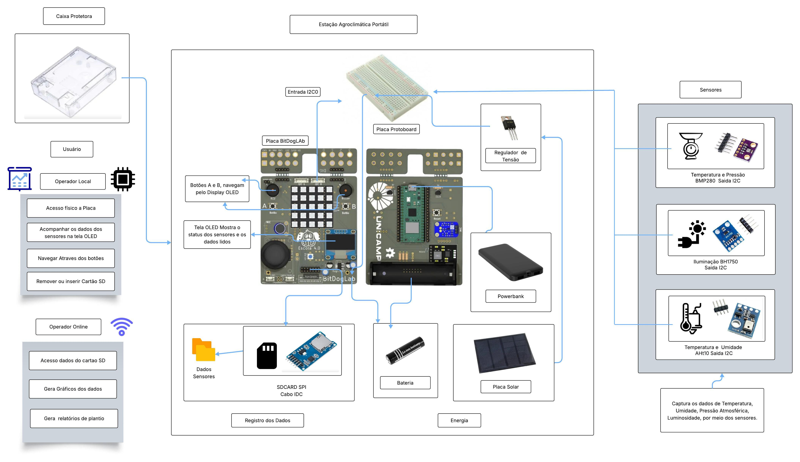
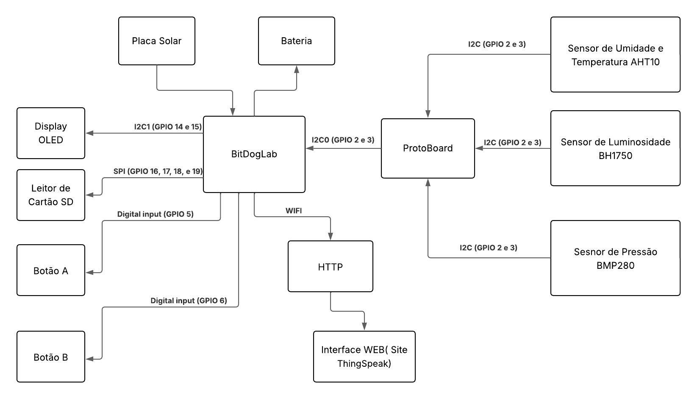
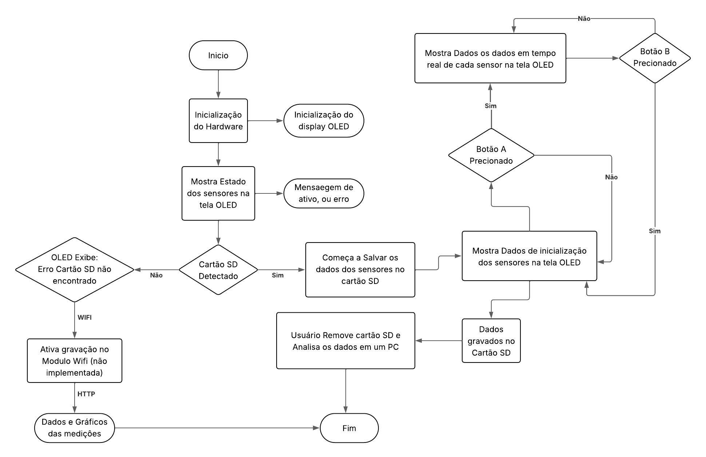
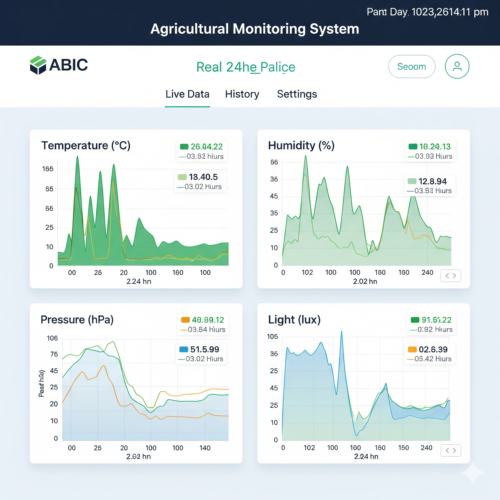

# 🌾 **Estação Agroclimática Portátil**  

**Instituição**: Instituto de Hardware BR-DF  
**Curso**: Residência tecnologica em sistemas embarcados
**Autor**: **Rafael Florentino Barbosa**  
**Local**: Brasília-DF  
**Data**: Julho de 2025  

## 🎯 **Etapa 2 - Bloco Funcionais, Diagramas, Esquemas **  

---

## **Sobre este Repositório**  
Este repositório contém o desenvolvimento da **Estação Agroclimática Portátil**, uma mini-estação portátil e inteligente projetada para monitorar as condições climáticas em pequenas plantações de agricultura familiar, incorporando sistemas eletrônicos embarcados e princípios de IoT (Internet das Coisas). O projeto se concentra no monitoramento em tempo real de parâmetros críticos, como temperatura, umidade, exposição à luz e pressão atmosférica, ao longo do tempo, possibilitando análises sazonais e tomadas de decisão mais precisas sobre quais tipos de cultura e época do ano são mais adequadas para o plantio.

---

## 🛠️ **Visão geral do projeto**  

### **Descrição do problema**  
Produtores rurais de pequeno porte geralmente não têm acesso a dados meteorológicos locais precisos e contínuos. Essa limitação compromete o planejamento agrícola, principalmente em relação ao plantio, irrigação e colheita. Uma solução portátil e de baixo custo para coleta e visualização de dados ambientais pode trazer benefícios diretos ao desempenho e à sustentabilidade da produção.

### ⚙️ **Objetivo da Solução**  
Desenvolver uma mini-estação portátil e inteligente que:
- Monitore  **temperatura, humidade, luz e pressão** em tempo real.  
- Emita  **Na tela OLED** os dados coletados dos sesnores.  
- Armazene **No cartão SD** todos os dados coletados pelos sensores durante o ano para futura analize.  

---

## ✅ **Requisitos Funcionais (RF)**  

| Code | Functional Requirement |  
|------|------------------------|  
| RF01 | Coletar os Dados de Temperatura. |  
| RF02 | Coletar os Dados de Pressão. |  
| RF03 | Coletar os Dados de Umidade . |  
| RF04 | Coletar os Dados de Luminosidade. |  
| RF05 | Exibe dados dos sensores em uma tela. |  
| RF06 | Armazenar os dados coletados no Cartão SD em intervalos de tempo. |  
| RF07 | Mostrar o Status de Armazenamento, se gravou ou não. |  
| RF08 | Ao pressionar o botão A, a tela deve alternar para a Tela 2 (valores). Ao pressionar o botão B, a tela deve alternar para a Tela 1 (status) |  

---

## 🚫 **Requisitos não Funcionais **  

| Code | Non-Functional Requirement |  
|------|---------------------------|  
| RNF01 | Interface amigável para o usuario na tela Oled. |  
| RNF02 | Sensores de alta precisão com tempo de resposta rápido. |  
| RNF03 | Fixação segura dos componentes |  
| RNF04 | Baixo consumo de energia. |  
| RNF05 | O código deve ser modular. |  
| RNF06 | O sistema deve operar continuamente. | 
| RNF07 | O software deve ser implementado usando FreeRTOS, garantindo multitarefa e gerenciamento eficiente de tarefas concorrentes. | 

---

## 📦 **Lista de Materiais**  

### 🧾 Tabela 3 - Lista de Materiais 
| Item | Quantidade | Descrição |
|------|------------|-----------|
| Caixa de plástico ou madeira | 1 | Recipiente base para proteção dos componentes |
| Placa BitDogLab com Raspberry Pi Pico W | 1 | Microcontrolador com periféricos integrados (OLED, botões) |
| Placa Protoboard | 1 | conectada a entrada I2C0  |
| Sensor de Temperatura e Pressão BMP280 | 1 | Sensor externo conectado via Placa Protoboard|
| Sensor de Umidade e Temperatura AHT10 | 1 | Sensor externo conectado via Placa Protoboard |
| Sensor de Luminosidade BH1750 | 1 | Sensor externo conectado via Placa Protoboard |
| Placa para SDCARD SPI | 1 | Módulo externo conectado via conector IDC direto |
| Cabos customizados XH I2C | 1 | Para conexão do sensore externos à BitDogLab |
| Cabos jumper macho/femea | 4 | Para conexão da protoboard na entrada i2c0 da BitDogLab |
| Cabos jumper macho/femea | 12 | Para conexão dos sensores na protoboard sensores externos à BitDogLab |
| Fonte de energia (power bank ou bateria Li-ion) | 1 | Alimentação portátil para o sistema |
| Botão A | 1 | Mudar Tela do Display oled |
| Botão B | 1 | Mudar Tela do Display oled |

---

## 📦 **Lista de MAteriais**  

### 🧾 Tabela 3 - Lista de Materiais 
| Item | Quantidade | Descrição |
|------|------------|-----------|
| Caixa de plástico ou madeira | 1 | Recipiente base para proteção dos componentes |
| Placa BitDogLab com Raspberry Pi Pico W | 1 | Microcontrolador com periféricos integrados (OLED, botões) |
| Placa Protoboard | 1 | conectada a entrada I2C0  |
| Sensor de Temperatura e Pressão BMP280 | 1 | Sensor externo conectado via Placa Protoboard|
| Sensor de Umidade e Temperatura AHT10 | 1 | Sensor externo conectado via Placa Protoboard |
| Sensor de Luminosidade BH1750 | 1 | Sensor externo conectado via Placa Protoboard |
| Placa para SDCARD SPI | 1 | Módulo externo conectado via conector IDC direto |
| Cabos customizados XH I2C | 1 | Para conexão do sensore externos à BitDogLab |
| Cabos jumper macho/femea | 4 | Para conexão da protoboard na entrada i2c0 da BitDogLab |
| Cabos jumper macho/femea | 12 | Para conexão dos sensores na protoboard sensores externos à BitDogLab |
| Fonte de energia (power bank ou bateria Li-ion) | 1 | Alimentação portátil para o sistema |

---

## **Estrutura do Projeto**  

### **Principais Características**  
✅ **Monitoramento em Tempo Real**: Sensores monitoram temperatura, umidade, luz e pressão atmosférica.  
✅ **Tela de informações**: Tela Oled com as informações dos sensores.  
✅ **Registro de Dados**: Armazena os dados em um cartão SD ou transmite dados para supervisão remota(Wi-fi).  
✅ **Operação Autônoma**: Alimentado por bateria ou Powerbank para portabilidade.  

### **Fluxo de Trabalho do Sistema**  
1. **Sensores** Coletam dados ambientais.  
2. **BitDogLab (RP2040)** Processa dados e salva no Cartão SD.  
3. **Display OLED** Mostra na tela os dados dos sensores.  
4. **Conectividade Wi-Fi** (opcional) Será implementada no futuro.  


## Arquitetura do Sistema

### 📷 **Diagrama de Hardware**  



Explicação: Este diagrama detalha as conexões físicas e protocolos usados:

- GPIO: Display OLED, Botões A e B 
- PWM: Controle de LED RGB
- ADC: Sensor de umidade do solo capacitivo
- I2C: Usado para comunicação com sensores (BMP280, BH1750) e display OLED
- SPI: Comunicação com cartão MicroSD para armazenamento de dados

Observação: componente tem endereços específicos e frequências de operação otimizadas para sua função.


### Esquemático de hardware BitdogLb


- O esquemático de hardware apresentado da BitDogLab mostra uma solução eletrônica robusta e bem organizada, projetada para aplicações de aquisição de dados e controle embarcado, como no seu projeto de estação agroclimática portátil. O coração do circuito é o microcontrolador Raspberry Pi Pico, destacando-se pelas diversas conexões a periféricos essenciais por meio de seus pinos GPIO, que viabilizam a integração de sensores, atuadores e interfaces de comunicação.

- O esquema está segmentado por blocos funcionais que facilitam a compreensão e a montagem do hardware. Entre eles, observa-se:

- Alimentação (POWER/CHARGE/BAT): Blocos dedicados ao gerenciamento da energia, incluindo carregamento da bateria Li-ion, proteção e distribuição de tensões reguladas, garantindo autonomia e proteção ao circuito.

- Entradas e Saídas: Conectores para LED RGB, matriz de LEDs, botões (BUTTONS), buzzer (BUZZERS) e joystick, ampliando as opções de interface e sinalização local do sistema.

- Conectividade: Diversos conectores (I2C, JACK), permitindo expansão e comunicação com sensores externos como temperatura, umidade, pressão e luminosidade.

- Microfone e OLED: Blocos para entrada analógica e exibição de dados, fundamentais em aplicações de monitoramento e feedback visual imediato.

- O microcontrolador atua como unidade central, direcionando sinais e dados entre os sensores, a interface de usuário (display OLED, LEDs, botões) e o módulo de armazenamento ou comunicação remota. Os cuidados com proteção elétrica e disposição clara dos sinais contribuem para a confiabilidade do sistema em campo.

- No seu projeto, essa arquitetura de hardware permite o monitoramento ambiental eficiente, coleta de dados precisa, armazenamento seguro em cartão SD e interfaces amigáveis ao usuário. Além disso, a flexibilidade de expansão, proporcionada por conectores e barramentos padrão, prepara o sistema tanto para operação autônoma quanto para integração com redes IoT e plataformas web, reforçando a aplicabilidade prática no contexto agrícola.

### Blocos funcionais ###



O diagrama de blocos funcionais  apresentado ilustra a arquitetura do sistema da Estação Agroclimática Portátil, detalhando a integração entre seus principais componentes. No coração do sistema está a placa BitDogLab, responsável pelo processamento e gerenciamento das informações provenientes dos sensores e periféricos conectados. Os sensores ambientais, como o de umidade e temperatura (AHT10), luminosidade (BH1750) e pressão (BMP280), são ligados à protoboard, que atua como interface para o barramento I2C (GPIO 2 e 3). Essa configuração garante a leitura eficiente e simultânea dos dados ambientais, essenciais para o monitoramento climático.

O display OLED, conectado através da interface I2C1 (GPIO 14 e 15), exibe em tempo real os dados capturados pelos sensores, proporcionando ao usuário uma visualização clara das condições monitoradas. O sistema conta ainda com um leitor de cartão SD, conectado via SPI (GPIO 16, 17, 18 e 19), que armazena os registros dos dados para análises futuras. O botão A, conectado por entrada digital (GPIO 5), possibilita a interação direta do usuário, como por exemplo iniciar ou marcar eventos de coleta de dados.

A solução também prevê conectividade remota por meio de um módulo Wi-Fi, permitindo o envio dos dados para um broker MQTT. Esse bloco possibilita a transmissão dos valores coletados para uma interface web, acessível via HTTP, ampliando as possibilidades de acompanhamento remoto e tomada de decisão baseada em dados em tempo real.

Cada bloco funcional do sistema foi planejado para garantir modularidade, confiabilidade e facilidade de manutenção, tornando a estação flexível para futuras expansões e adaptações conforme novas demandas de monitoramento agrícola surjam.


### Fluxograma do software ###



O fluxograma apresentado descreve de forma clara e sequencial o funcionamento do sistema da Estação Agroclimática Portátil, evidenciando suas principais etapas de operação. O processo inicia-se com a inicialização do hardware e do display OLED, seguida pela exibição do estado dos sensores na tela. O sistema verifica a presença do cartão SD para garantir o armazenamento dos dados coletados: se o cartão não for detectado, é exibida uma mensagem de erro no display e, opcionalmente, pode ser ativado o envio dos dados via Wi-Fi (função ainda não implementada).

Se o cartão SD for reconhecido, o equipamento começa a salvar as medições ambientais automaticamente, permitindo que o usuário visualize os dados diretamente no display OLED ou, posteriormente, remova o cartão para analisar as informações em um computador. O fluxograma também contempla a interação por meio do Botão A, possibilitando ao usuário acessar mais dados no display conforme necessário. Dessa forma, o fluxograma retrata um fluxo funcional eficiente, que abrange as principais rotinas operacionais e alternativas do sistema, garantindo praticidade e facilidade de uso no campo.


### 🔧 Protocolos de Comunicação ###

- I2C (Inter-Integrated Circuit) — utilizado para comunicação entre o microcontrolador BitDogLab e os sensores (AHT10, BH1750, BMP280) e também com o display OLED, permitindo comunicação serial síncrona entre múltiplos dispositivos.

- SPI (Serial Peripheral Interface) — empregado para comunicação entre o microcontrolador e o leitor de cartão SD, garantindo um protocolo de alta velocidade para transferência de dados ao armazenar as informações coletadas.

- Digital Input — para a leitura dos botões físicos (Botão A), representando uma entrada digital simples para interação do usuário.

- Wi-Fi — comunicação sem fio para envio de dados via broker MQTT, possibilitando a transmissão das informações para uma interface web, viabilizando monitoramento remoto (em fase de implementação futura).

- HTTP — protocolo usado para o acesso e visualização dos dados armazenados no broker MQTT através de uma interface web.

### Exemplo de Dashboard caso o modulo Wifi seja implementado no futuro ###



## 📊 Dados coletados

### Temperatura: 27,7 °C
> Temperatura do ar ao redor do sensor.

- Para a maioria das plantas tropicais e hortaliças, está em uma faixa boa (25–30 °C é ideal para crescimento).  
- Se passar de 35 °C, pode começar a causar estresse térmico.  
- Se cair abaixo de 15 °C, o crescimento desacelera.

---

### Umidade relativa: 32,4 %
> Mede quão úmido está o ar.

- Esse valor é considerado baixo. A maioria das plantas gosta de 50–70 %.  
- Umidade baixa pode causar ressecamento das folhas e acelerar a evaporação da água do solo.  
- Pode ser um alerta para irrigação mais frequente ou uso de sombreamento/microaspersão para manter umidade.

---

### Luminosidade: ~104 lux
> Intensidade de luz medida.

- 104 lux é bem baixo — equivale a um ambiente fechado ou sombra pesada.  
- Para cultivo:  
  - Hortaliças precisam de 5.000 a 15.000 lux.  
  - Plantas frutíferas e grãos precisam de 15.000–50.000 lux.  
- Sugere que o sensor está em ambiente pouco iluminado (talvez dentro de casa ou à noite).  
- Esses dados servem para monitorar a quantidade de luz solar recebida ao longo do dia, garantindo fotossíntese adequada.

---

### Pressão atmosférica: 891,2 hPa
> Indica a pressão do ar no local.

- O valor esperado ao nível do mar é ~1013 hPa.  
- 891 hPa sugere que você está em região de maior altitude (cerca de 1000–1200 m).  
- Útil para:  
  - Relacionar com clima (quedas rápidas de pressão podem indicar chuva).  
  - Ajustar cálculos de evapotranspiração.

---

## 🌾 Como usar esses dados na sua plantação

### Temperatura e Umidade
- Programar alertas para irrigação se a umidade do ar ficar muito baixa por muito tempo.  
- Detectar risco de estresse térmico em ondas de calor.

### Luminosidade (Lux)
- Verificar se as plantas estão recebendo luz suficiente para fotossíntese.  
- Se valores ficarem baixos mesmo durante o dia:  
  - Reposicionar mudas para mais sol.  
  - Reduzir sombreamento.  
  - Usar iluminação artificial em estufas.

### Pressão atmosférica
- Usar como indicador de previsão do tempo local:  
  - Queda repentina → possível chuva.  
  - Estabilidade → clima firme.  
- Pode ajudar a decidir irrigação (não irrigar antes de chuva prevista).

---

### 👉 Resumo
- **Temp/Umidade** → saúde da planta e evaporação.  
- **Lux** → fotossíntese / energia disponível para crescimento.  
- **Pressão** → previsão climática e ajuste da irrigação.

## 📂 Estrutura do Projeto  
```  
├── app/
│ └── main.c # Programa principal
├── drivers/
│ ├── ssd1306.c # Driver OLED SSD1306
│ ├── ssd1306.h
│ ├── ssd1306_i2c.c
│ ├── ssd1306_i2c.h
│ └── ssd1306_font.h
├── hal/
│ ├── AHT10.c # Leitura AHT10
│ ├── BH1750.c # Leitura BH1750
│ ├── BMP280.c # Leitura BMP280
│ ├── buttons.c # Botoes A e B
│ ├── i2c_setup.c # Configura porta i2c
│ └── display.c # Funções do display OLED
├── include/
│ ├── AHT10.h
│ ├── BH1750.h
│ ├── BMP280.h
│ ├── buttons.h
│ ├── i2c_setup.h
│ ├── FreeRTOSConfig.h
│ ├── lwipopts.h
│ └── display.h
├── lib/
│ ├── hw_config.h
│ ├── sd_card.c
│ └── sd_card.h
├── no-OS-FatFS-SD-SPI-RPi-Pico/
├── CMakeLists.txt
└── README.md
```  
---


## **Referências**  

- **Embrapa** –  Internet das Coisas testada em irrigação de precisão.  
- **Blog Aegro**  – Irrigação de precisão: como ela pode gerar economia para a fazenda.
- **MakerHero** – Estação meteorológica com Raspberry Pi Pico .  
- **Guilherme Lopes** –Projeto de estação meteorológica portátil.  

- Matias, Guilherme Lopes. (2025). Projeto de estação meteorológica portátil para monitoramento remoto das condições climáticas – USP. Monografia detalhando implementação com IoT, sensores ambientais e automação em pequenas propriedades rurais. Projeto de estação meteorológica portátil para monitoramento remoto das condições climáticas – USP

- MakerHero. (2025). Estação meteorológica com Raspberry Pi Pico 2 W. Tutorial de montagem usando sensores BMP280/AHT10 e interface web para visualização dos dados ambientais coletados. Estação meteorológica com Raspberry Pi Pico 2 W – MakerHero

- Costa, Denis et al. (2023). Desenvolvimento de uma estação agroclimatológica de baixo custo – Ciência e Natura. Artigo acadêmico abordando estações com Raspberry Pi, sensores pedagógicos, operação externa e caixa protetora. Desenvolvimento de uma estação agroclimatológica de baixo custo – Ciência e Natura

- SILVA, J.; MENDES, L. S. Monitoramento ambiental usando IoT: aplicações em agricultura de precisão. Agritec Journal, v. 11, n. 1, p. 55-63, 2024.

- MACHADO, R. T.; OLIVEIRA, F. S. Desenvolvimento de estações meteorológicas portáteis para agricultura de pequena escala. In: Anais do Congresso Brasileiro de Engenharia Agrícola, 2023.


---

## **License**  
Este projeto está licenciado sob a **[MIT License](LICENSE)**.  

---  
