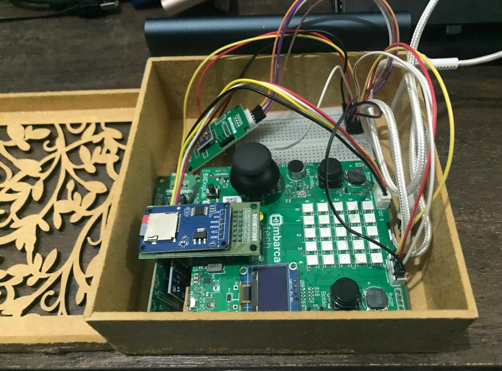
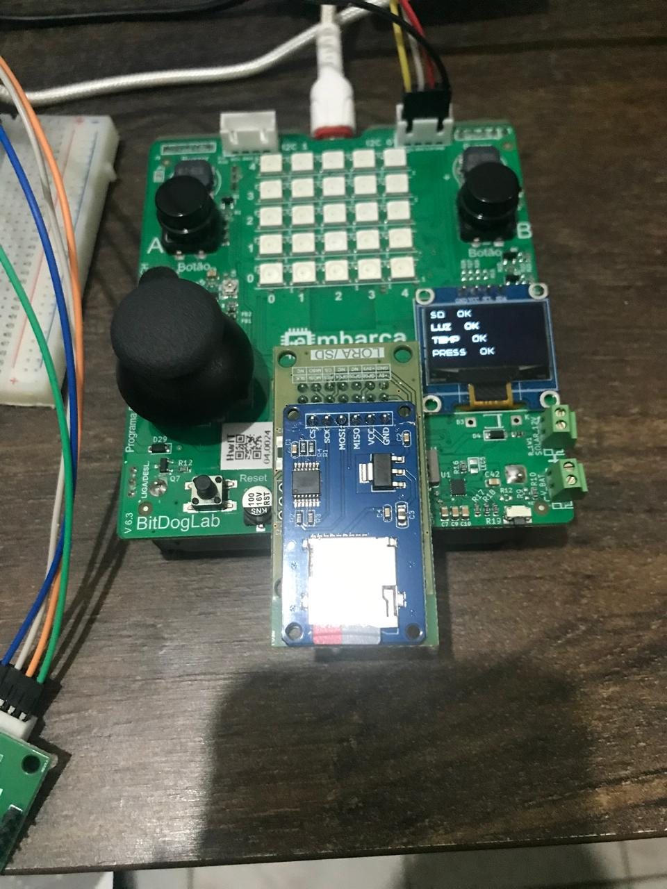
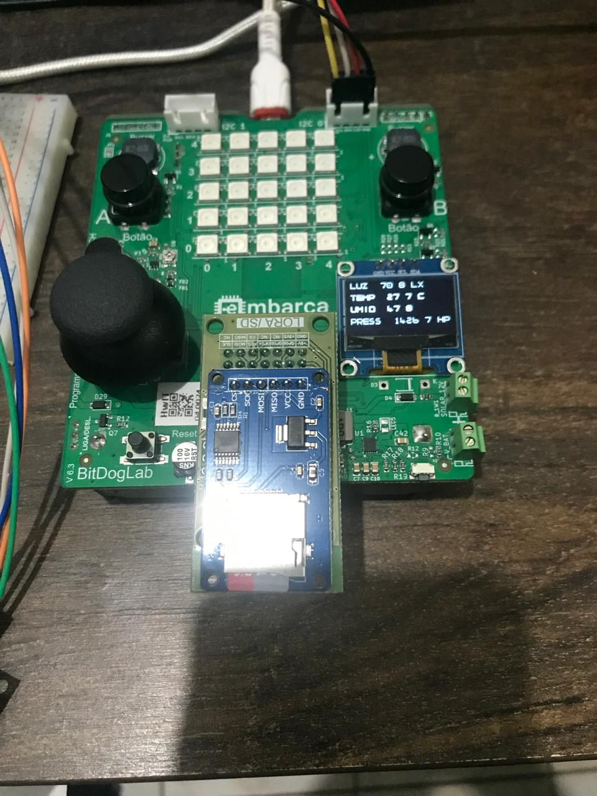
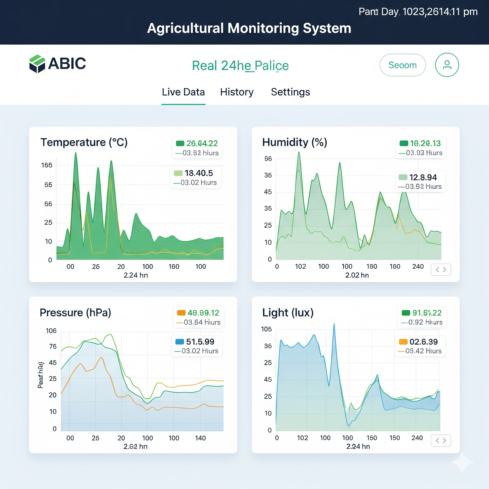
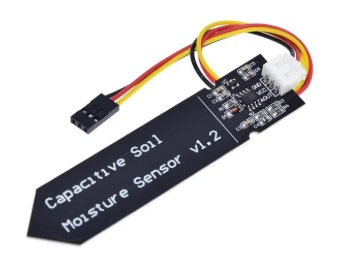
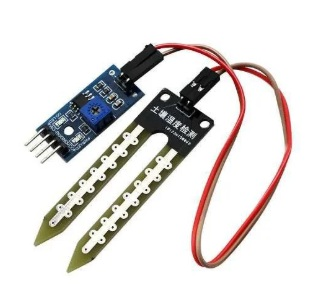
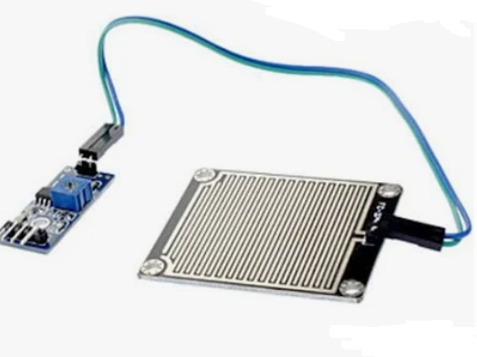

# 🌾 ** Estação Agroclimática Portátil**  #

## 🎯 **Etapa 3 - Prototipagem e Ajustes **  ##

**Instituição**: Instituto de Hardware BR-DF  
**Curso**: Residência tecnologica em sistemas embarcados
**Autor**: **Rafael Florentino Barbosa**  
**Local**: Brasília-DF  
**Data**: Julho de 2025  

---

## 🎥 Fotos e Vídeos ##

Link Video: https://youtube.com/shorts/cSL2xntXBJg?feature=share

Fotos:

- Estação Agroclimática Portátil em mdf

- Tela 1 do diplay OLED

- Tela 2 do diplay OLED

-  Exemplo de Dashboard caso o modulo Wifi seja implementado no futuro 

## 📊 Dados coletados ##

### Temperatura: 27,7 °C ###
> Temperatura do ar ao redor do sensor.

- Para a maioria das plantas tropicais e hortaliças, está em uma faixa boa (25–30 °C é ideal para crescimento).  
- Se passar de 35 °C, pode começar a causar estresse térmico.  
- Se cair abaixo de 15 °C, o crescimento desacelera.

---

### Umidade relativa: 32,4 % ###
> Mede quão úmido está o ar.

- Esse valor é considerado baixo. A maioria das plantas gosta de 50–70 %.  
- Umidade baixa pode causar ressecamento das folhas e acelerar a evaporação da água do solo.  
- Pode ser um alerta para irrigação mais frequente ou uso de sombreamento/microaspersão para manter umidade.

---

### Luminosidade: ~104 lux ###
> Intensidade de luz medida.

- 104 lux é bem baixo — equivale a um ambiente fechado ou sombra pesada.  
- Para cultivo:  
  - Hortaliças precisam de 5.000 a 15.000 lux.  
  - Plantas frutíferas e grãos precisam de 15.000–50.000 lux.  
- Sugere que o sensor está em ambiente pouco iluminado (talvez dentro de casa ou à noite).  
- Esses dados servem para monitorar a quantidade de luz solar recebida ao longo do dia, garantindo fotossíntese adequada.

---

### Pressão atmosférica: 891,2 hPa ###
> Indica a pressão do ar no local.

- O valor esperado ao nível do mar é ~1013 hPa.  
- 891 hPa sugere que você está em região de maior altitude (cerca de 1000–1200 m).  
- Útil para:  
  - Relacionar com clima (quedas rápidas de pressão podem indicar chuva).  
  - Ajustar cálculos de evapotranspiração.

---

## 🌾 Como usar esses dados na sua plantação ##

### Temperatura e Umidade ###
- Programar alertas para irrigação se a umidade do ar ficar muito baixa por muito tempo.  
- Detectar risco de estresse térmico em ondas de calor.

### Luminosidade (Lux) ###
- Verificar se as plantas estão recebendo luz suficiente para fotossíntese.  
- Se valores ficarem baixos mesmo durante o dia:  
  - Reposicionar mudas para mais sol.  
  - Reduzir sombreamento.  
  - Usar iluminação artificial em estufas.

### Pressão atmosférica  ###
- Usar como indicador de previsão do tempo local:  
  - Queda repentina → possível chuva.  
  - Estabilidade → clima firme.  
- Pode ajudar a decidir irrigação (não irrigar antes de chuva prevista).

---

### 👉 Resumo ###
- **Temp/Umidade** → saúde da planta e evaporação.  
- **Lux** → fotossíntese / energia disponível para crescimento.  
- **Pressão** → previsão climática e ajuste da irrigação.

## Desafios Encontrados Durante o Desenvolvimento ##
Durante o desenvolvimento do protótipo da Estação Agroclimática Portátil, vários desafios foram enfrentados, principalmente relacionados à montagem física dos componentes e à integração dos diferentes sensores. A limitação de espaço no invólucro exigiu uma organização cuidadosa tanto do posicionamento das placas e módulos quanto do roteamento dos cabos para evitar interferências e garantir robustez elétrica. Outro ponto crítico foi o ajuste da comunicação entre os módulos, especialmente na configuração dos barramentos I2C e SPI, onde pequenas incompatibilidades de ligação ou endereçamento poderiam comprometer a leitura correta dos dados. Além disso, surgiram dificuldades na implementação do armazenamento seguro dos dados no cartão SD, exigindo refino do software para lidar com falhas de escrita e detecção do cartão.

## Melhorias Planejadas ##
Entre as melhorias planejadas para as próximas versões do projeto está a utilização de uma placa PCB dedicada, o que ajudará a reduzir o excesso de fios, proporcionar maior confiabilidade das conexões e facilitar a montagem e manutenção do dispositivo. Está prevista também a implementação do módulo Wi-Fi para transmissão remota dos dados em tempo real, ampliando o potencial de monitoramento e automação agrícola. Outras melhorias incluem a adoção de um gabinete mais robusto e com melhor vedação para uso em ambientes externos, a otimização do consumo energético para aumentar a autonomia e a expansão do sistema de interface do usuário, tornando o display OLED ainda mais intuitivo e informativo.

- Inserir o sensor de solo A

- Inserir o sensor de solo B

- Inserir o sensor de chuva

