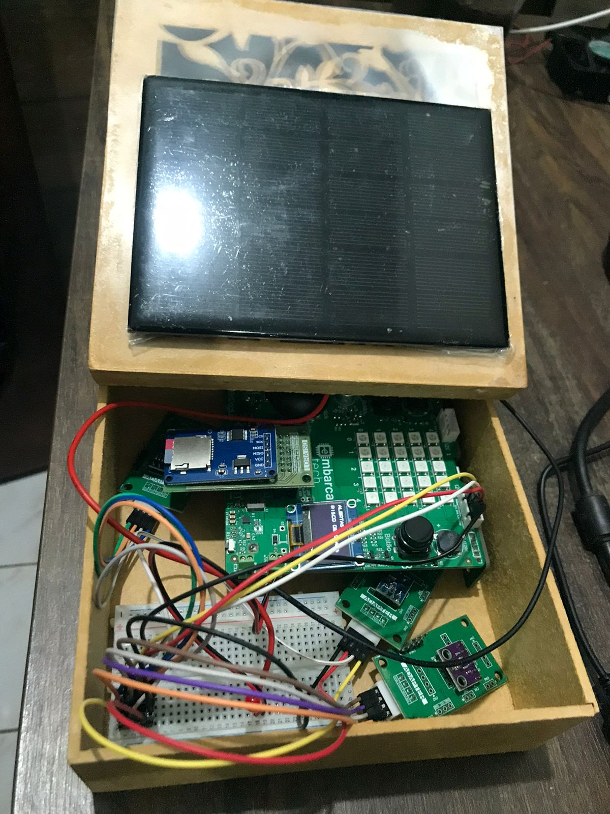

# 🌾 Estação Agroclimática Portátil  

**Instituição**: Instituto de Hardware BR-DF  
**Curso**: Residência tecnológica em sistemas embarcados  
**Autor**: Rafael Florentino Barbosa  
**Local**: Brasília-DF  
**Data**: Julho de 2025  

---

Este repositório contém o desenvolvimento da **Estação Agroclimática Portátil**, uma mini-estação portátil e inteligente projetada para monitorar as condições climáticas em pequenas plantações de agricultura familiar, incorporando sistemas eletrônicos embarcados e princípios de IoT (Internet das Coisas).  

O projeto se concentra no monitoramento em tempo real de parâmetros críticos, como **temperatura, umidade, exposição à luz e pressão atmosférica**, possibilitando análises sazonais e tomadas de decisão mais precisas sobre quais tipos de cultura e épocas do ano são mais adequadas para o plantio.  

Entre as decisões agrícolas mais relevantes:  
- **Planejamento do plantio** → identificar a época mais adequada para semear, com base em temperatura e umidade do solo/ar.  
- **Irrigação** → ajustar a quantidade e frequência de irrigação, evitando desperdício de água.  
- **Proteção de culturas** → prever riscos de geada ou calor excessivo que podem afetar a produção.  
- **Controle de pragas e doenças** → correlacionar níveis de umidade e temperatura com condições favoráveis ao surgimento de pragas (como fungos).  
- **Colheita** → identificar janelas ideais para colher, maximizando produtividade e qualidade.  

---

## 🛠️ Visão Geral do Projeto  

### Descrição do Problema  
Produtores rurais de pequeno porte geralmente não têm acesso a dados meteorológicos locais precisos e contínuos. Essa limitação compromete o planejamento agrícola, principalmente em relação ao plantio, irrigação e colheita.  

Uma solução portátil e de baixo custo para coleta e visualização de dados ambientais pode trazer benefícios diretos ao desempenho e à sustentabilidade da produção.  

### ⚙️ Objetivo da Solução  
Desenvolver uma mini-estação portátil e inteligente que:  
- Monitore **temperatura, umidade, luz e pressão** em tempo real.  
- Emita na **tela OLED** os dados coletados dos sensores.  
- Armazene no **cartão SD** todos os dados coletados pelos sensores durante o ano para futura análise.  
- Envie por **Wi-Fi** todos os dados coletados pelos sensores para o site ThingSpeak, onde são gerados gráficos.  
- Recarregue por **Painel Solar** a bateria que alimenta a BitDogLab.  

---

## ✅ Requisitos Funcionais (RF)  

| Código | Requisitos Funcionais |  
|--------|------------------------|  
| RF01   | Coletar os Dados de Temperatura. |  
| RF02   | Coletar os Dados de Pressão. |  
| RF03   | Coletar os Dados de Umidade. |  
| RF04   | Coletar os Dados de Luminosidade. |  
| RF05   | Exibir dados dos sensores, e da rede Wi-Fi em uma tela OLED. |  
| RF06   | Armazenar os dados coletados no Cartão SD em intervalos de tempo. |  
| RF07   | Mostrar o status de armazenamento, se gravou ou não. |  
| RF08   | Ao pressionar o botão A, a tela deve avançar para tela seguinte. Ao pressionar o botão B, a tela deve voltar sempre para a Tela 1 (status). |  
| RF09   | Exibir mensagens de alerta na tela OLED quando condições críticas forem detectadas (ex.: risco de geada, fungos, calor excessivo, tendência de chuva). |  
| RF10   | Enviar os dados por Wi-Fi para o site ThingSpeak. |  
| RF11   | Recarregar a bateria com energia do painel solar através da BitDogLAb. |  
| RF12   | Definir o intervalo de leitura dos sensores e o modo de gravação dos dados no cartão SD. |  

---

## 🚫 Requisitos Não Funcionais (RNF)  

| Código | Requisitos Não Funcionais | Detalhamento |
|--------|----------------------------|--------------|
| RNF01  | Interface amigável para o usuário na tela OLED. | Layout simples, alternância clara entre status e valores. Texto legível em ambientes externos (fonte ≥ 8x8 px). |
| RNF02  | Sensores de alta precisão com tempo de resposta rápido. | Precisão mínima: ±0,5 °C (temperatura), ±3% UR (umidade), ±1 hPa (pressão), ±1 lux (luminosidade). Tempo de resposta < 2s para leitura estável. |
| RNF03  | Fixação segura dos componentes. | Sensores montados em caixa protetora com vedação contra chuva e poeira (IP54). Conexões firmes com cabos XH e protoboard fixada. |
| RNF04  | Baixo consumo de energia. | O consumo total ≤ 200 mA em operação contínua, garantindo autonomia mínima de 8h com um powerbank de 5000 mAh |
| RNF05  | O código deve ser modular. | Separação clara entre camadas (drivers, HAL, aplicação, include). Cada sensor deve possuir módulo independente e reaproveitável. |
| RNF06  | O sistema deve operar continuamente. | Sistema deve funcionar por pelo menos 7 dias sem necessidade de reinicialização manual. |
| RNF07  | O software deve ser implementado usando FreeRTOS, multitarefa. | Cada função crítica (coleta de dados, exibição, gravação em SD) deve rodar como tarefa independente, com prioridade definida. Scheduler deve garantir que leituras não atrasem mais que 1s. |
| RNF08  | Clareza dos alertas exibidos. | Mensagens devem ser curtas (≤ 20 caracteres), exibidas por pelo menos 5 segundos e facilmente interpretáveis pelo agricultor. |
| RNF09 | Sustentabilidade energética. | O sistema deve priorizar uso de energia solar sempre que disponível, reduzindo dependência de fontes externas. |

---

## 📦 Lista de Materiais  

| Item | Quantidade | Descrição |
|------|------------|-----------|
| Caixa de plástico ou madeira | 1 | Recipiente base para proteção dos componentes |
| Placa BitDogLab com Raspberry Pi Pico W | 1 | Microcontrolador com periféricos integrados (OLED, botões, Wi-Fi) |
| Placa Protoboard | 1 | Conectada à entrada I2C0 |
| Sensor de Temperatura e Pressão BMP280 | 1 | Sensor externo conectado via Protoboard |
| Sensor de Umidade e Temperatura AHT10 | 1 | Sensor externo conectado via Protoboard |
| Sensor de Luminosidade BH1750 | 1 | Sensor externo conectado via Protoboard |
| Placa para SD Card SPI | 1 | Módulo externo conectado via conector IDC direto |
| Cabos customizados XH I2C | 1 | Para conexão dos sensores externos à BitDogLab |
| Cabos jumper macho/fêmea | 4 | Para conexão da protoboard na entrada I2C0 |
| Cabos jumper macho/fêmea | 12 | Para conexão dos sensores na protoboard |
| Bateria lítio 3,7V recarregável, Power Bank(Opcional) | 1 | Alimentação portátil para o sistema |
| Mini Painel solar 6V - 320 mA | 1 | Para carregar a BitDogLab que carregará a bateria de 3.7v da placa |
| Regulador de tensão LM7805 (5V / 1A) | 1 |Para conectar a Painel Solar a bitdolab pela protoboard |
| Botão A | 1 | Avançar as telas do display OLED |
| Botão B | 1 | Voltar a tela de status no display OLED |

---

## ⚠️ Tabela 4 - Alertas do Sistema  

| Parâmetro                  | Condição                        | Mensagem na Tela OLED | Impacto Agrícola                                         |
|-----------------------------|---------------------------------|-----------------------|----------------------------------------------------------|
| **Temperatura**            | `< 5 °C`                        | ⚠️ Risco de geada     | Pode queimar folhas e comprometer mudas.                 |
|                             | `> 35 °C`                       | ⚠️ Calor excessivo    | Risco de estresse térmico e perda de produtividade.      |
| **Umidade Relativa do Ar** | `< 30%`                         | ⚠️ Umidade baixa      | Necessidade de irrigação para evitar estresse hídrico.   |
|                             | `> 85%`                         | ⚠️ Risco de fungos    | Alta chance de doenças fúngicas (ex.: míldio, ferrugem). |
| **Luminosidade**           | `< 200 lux` (em horário de sol) | ⚠️ Luz insuficiente   | Risco de estiolamento das plantas.                       |
|                             | `> 50.000 lux`                  | ⚠️ Sol intenso        | Pode causar queimadura foliar.                           |
| **Pressão Atmosférica**    | Queda rápida (> 2 hPa em 3h)    | ⚠️ Tendência de chuva | Permite planejar irrigação e colheita.                   |
|                             | Alta estável (> 1020 hPa)       | ☀️ Tempo estável      | Indica boas condições climáticas.                        |

---

## ⏱️ Estratégia de Coleta e Armazenamento  

- **Período de leitura dos sensores**: a cada **5 segundos**, todos os sensores (temperatura, umidade, pressão e luminosidade) são lidos.  
- **Exibição na tela OLED**: atualização sincronizada a cada 5 segundos junto com as leituras.  
- **Armazenamento no cartão SD**: gravação em **lotes de 1 minuto** (12 medições agrupadas em uma única linha).  
- **Formato de gravação**: dados registrados em **CSV**, no padrão:  

```
Temp: 28.95 | Umid: 26.89 | Press: 890.85 | Lux: 101.67 
Temp: 28.93 | Umid: 26.74 | Press: 890.77 | Lux: 103.33 
Temp: 28.95 | Umid: 26.97 | Press: 887.80 | Lux: 103.80

ou:

Data,Hora,Temperatura(°C),Umidade(%),Pressão(hPa),Luminosidade(lux)
05/09/2025,14:35:00,28.4,65,1012,1250
05/09/2025,14:36:00,28.7,64,1011,1275

```
### Justificativa Técnica  
- Leituras frequentes permitem detectar variações rápidas no microclima.  
- Armazenar em lotes reduz o desgaste do cartão SD e economiza energia.  
- O formato CSV facilita a análise posterior em planilhas (Excel, LibreOffice) ou softwares estatísticos.  

---

## 📊 Estrutura do Projeto  

### Principais Características  
✅ **Monitoramento em Tempo Real**: Sensores monitoram temperatura, umidade, luz e pressão atmosférica.  
✅ **Tela de Informações**: Tela OLED com dados dos sensores, da Wi-Fi, do cartão SD, dos Alertas.  
✅ **Registro de Dados**: Armazena informações em cartão SD ou transmite via Wi-Fi.  
✅ **Operação Autônoma**: Alimentado por bateria e recarregado com Painel Solar ou Powerbank para portabilidade.  

### Fluxo de Trabalho do Sistema  
1. **Sensores** coletam dados ambientais.  
2. **BitDogLab (RP2040)** processa dados e salva no cartão SD.  
3. **Display OLED** exibe dados coletados.  
4. **Conectividade Wi-Fi** Manda os dados para o site ThingSpeak, para visualização de gráficos.  
5. **Painel Solar + Bateria Li-Ion** garantem a autonomia energética da estação.
---

## 📷 **Imagens **  ##

- Fechado


- Aberto



---

## 📂 Estrutura do Projeto  
```  
├── src/
│ └── main.c # Programa principal
├── drivers/
│ ├── ssd1306.c # Driver OLED SSD1306
│ ├── ssd1306.h
│ ├── ssd1306_i2c.c
│ ├── ssd1306_i2c.h
│ └── ssd1306_font.h
├── hal/
│ ├── AHT10.c # Leitura AHT10
│ ├── BH1750.c # Leitura BH1750
│ ├── BMP280.c # Leitura BMP280
│ ├── buttons.c # Botoes A e B
│ ├── i2c_setup.c # Configura porta i2c
│ ├── thingspeak.c # Configura a conexão com site
│ └── display.c # Funções do display OLED
├── include/
│ ├── AHT10.h
│ ├── BH1750.h
│ ├── BMP280.h
│ ├── buttons.h
│ ├── credentials.h
│ ├── thingspeak.h
│ ├── i2c_setup.h
│ ├── FreeRTOSConfig.h
│ ├── lwipopts.h
│ └── display.h
├── lib/
│ ├── hw_config.h
│ ├── sd_card.c
│ └── sd_card.h
├── no-OS-FatFS-SD-SPI-RPi-Pico/
├── CMakeLists.txt
├── .gitignore
├── pico_sdk_import.cmake
└── README.md
```  
---


## ⚙️ Como Compilar ##

Antes de compilar, é necessário clonar os repositórios de dependências na raiz do projeto:


`git clone https://github.com/FreeRTOS/FreeRTOS-Kernel.git`

`git clone https://github.com/carlk3/no-OS-FatFS-SD-SPI-RPi-Pico`


---

## 📄 Licença  
Este projeto está licenciado sob a [MIT License](LICENSE).  

---