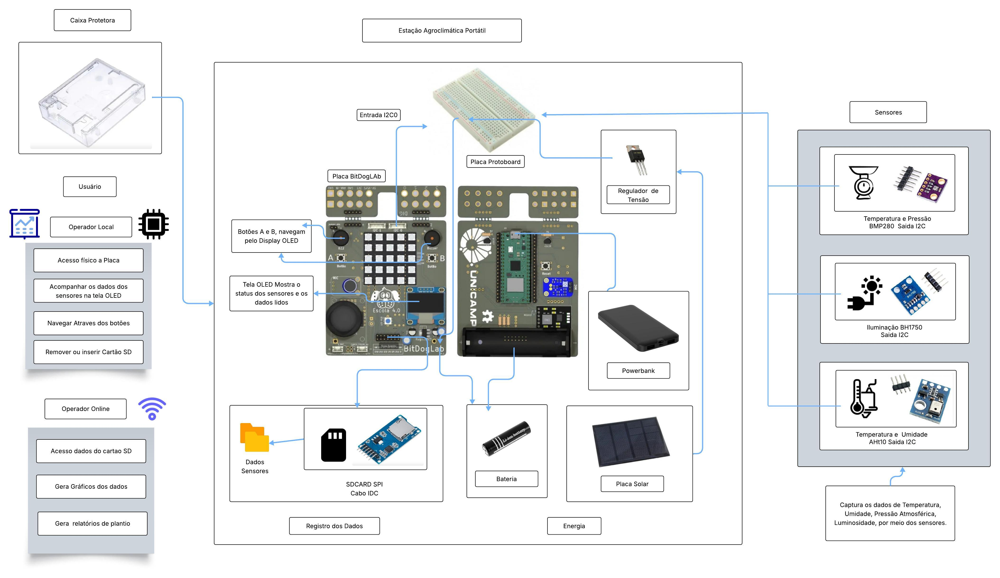
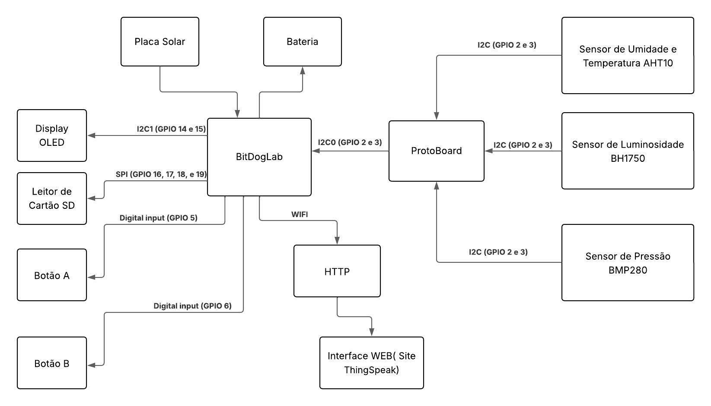
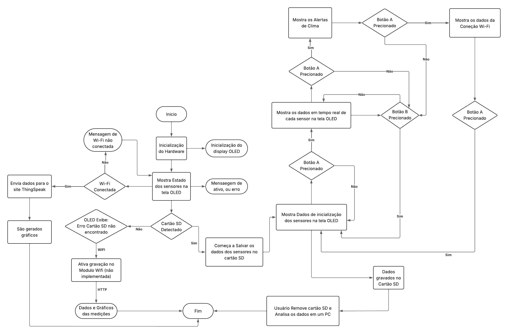
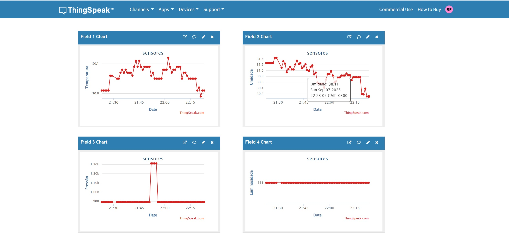
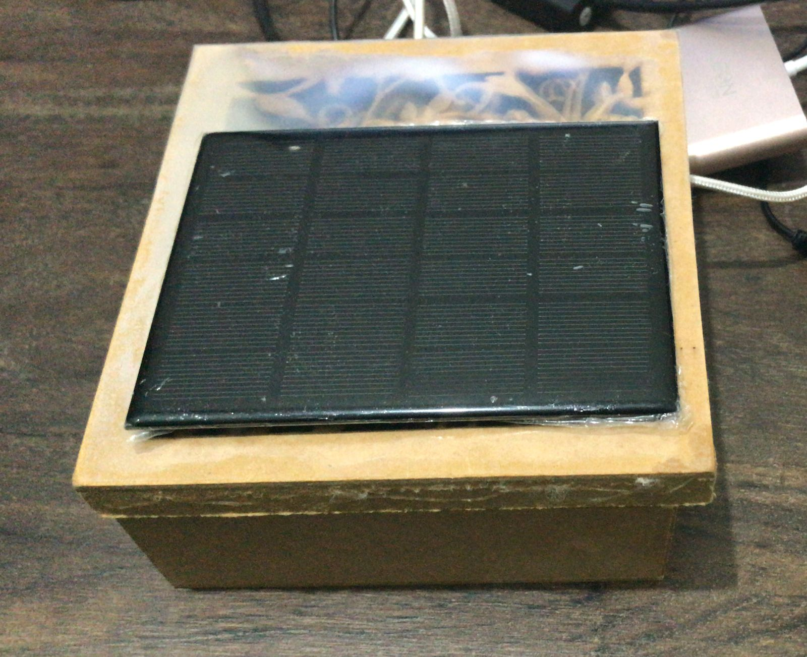

# 🌾 Estação Agroclimática Portátil  

**Instituição**: Instituto de Hardware BR-DF  
**Curso**: Residência tecnológica em sistemas embarcados  
**Autor**: Rafael Florentino Barbosa  
**Local**: Brasília-DF  
**Data**: Setembro de 2025  

## 🎯 Etapa 4 - Entrega Final


Este repositório contém o desenvolvimento da **Estação Agroclimática Portátil**, uma mini-estação portátil e inteligente projetada para monitorar as condições climáticas em pequenas plantações de agricultura familiar, incorporando sistemas eletrônicos embarcados e princípios de IoT (Internet das Coisas).  

O projeto se concentra no monitoramento em tempo real de parâmetros críticos, como **temperatura, umidade, exposição à luz e pressão atmosférica**, possibilitando análises sazonais e tomadas de decisão mais precisas sobre quais tipos de cultura e épocas do ano são mais adequadas para o plantio.  

Entre as decisões agrícolas mais relevantes:  
- **Planejamento do plantio** → identificar a época mais adequada para semear, com base em temperatura e umidade do solo/ar.  
- **Irrigação** → ajustar a quantidade e frequência de irrigação, evitando desperdício de água.  
- **Proteção de culturas** → prever riscos de geada ou calor excessivo que podem afetar a produção.  
- **Controle de pragas e doenças** → correlacionar níveis de umidade e temperatura com condições favoráveis ao surgimento de pragas (como fungos).  
- **Colheita** → identificar janelas ideais para colher, maximizando produtividade e qualidade.  

---


## 🛠️ Visão Geral do Projeto  

### Descrição do Problema  
Produtores rurais de pequeno porte geralmente não têm acesso a dados meteorológicos locais precisos e contínuos. Essa limitação compromete o planejamento agrícola, principalmente em relação ao plantio, irrigação e colheita.  

Uma solução portátil e de baixo custo para coleta e visualização de dados ambientais pode trazer benefícios diretos ao desempenho e à sustentabilidade da produção.  

### ⚙️ Objetivo da Solução  
Desenvolver uma mini-estação portátil e inteligente que:  
- Monitore **temperatura, umidade, luz e pressão** em tempo real.  
- Emita na **tela OLED** os dados coletados dos sensores.  
- Armazene no **cartão SD** todos os dados coletados pelos sensores durante o ano para futura análise.  
- Envie por **Wi-Fi** todos os dados coletados pelos sensores para o site ThingSpeak, onde são gerados gráficos.  
- Recarregue por **Painel Solar** a bateria que alimenta a BitDogLab.  

---


## ✅ Requisitos Funcionais (RF)  

| Código | Requisitos Funcionais |  
|--------|------------------------|  
| RF01   | Coletar os Dados de Temperatura. |  
| RF02   | Coletar os Dados de Pressão. |  
| RF03   | Coletar os Dados de Umidade. |  
| RF04   | Coletar os Dados de Luminosidade. |  
| RF05   | Exibir dados dos sensores, e da rede Wi-Fi em uma tela OLED. |  
| RF06   | Armazenar os dados coletados no Cartão SD em intervalos de tempo. |  
| RF07   | Mostrar o status de armazenamento, se gravou ou não. |  
| RF08   | Ao pressionar o botão A, a tela deve avançar para tela seguinte. Ao pressionar o botão B, a tela deve voltar sempre para a Tela 1 (status). |  
| RF09   | Exibir mensagens de alerta na tela OLED quando condições críticas forem detectadas (ex.: risco de geada, fungos, calor excessivo, tendência de chuva). |  
| RF10   | Enviar os dados por Wi-Fi para o site ThingSpeak. |  
| RF11   | Recarregar a bateria com energia do painel solar através da BitDogLAb. |  
| RF12   | Definir o intervalo de leitura dos sensores e o modo de gravação dos dados no cartão SD. |  

---

## 🚫 Requisitos Não Funcionais (RNF)  

| Código | Requisitos Não Funcionais | Detalhamento |
|--------|----------------------------|--------------|
| RNF01  | Interface amigável para o usuário na tela OLED. | Layout simples, alternância clara entre status e valores. Texto legível em ambientes externos (fonte ≥ 8x8 px). |
| RNF02  | Sensores de alta precisão com tempo de resposta rápido. | Precisão mínima: ±0,5 °C (temperatura), ±3% UR (umidade), ±1 hPa (pressão), ±1 lux (luminosidade). Tempo de resposta < 2s para leitura estável. |
| RNF03  | Fixação segura dos componentes. | Sensores montados em caixa protetora com vedação contra chuva e poeira (IP54). Conexões firmes com cabos XH e protoboard fixada. |
| RNF04  | Baixo consumo de energia. | O consumo total ≤ 200 mA em operação contínua, garantindo autonomia mínima de 8h com um powerbank de 5000 mAh |
| RNF05  | O código deve ser modular. | Separação clara entre camadas (drivers, HAL, aplicação, include). Cada sensor deve possuir módulo independente e reaproveitável. |
| RNF06  | O sistema deve operar continuamente. | Sistema deve funcionar por pelo menos 7 dias sem necessidade de reinicialização manual. |
| RNF07  | O software deve ser implementado usando FreeRTOS, multitarefa. | Cada função crítica (coleta de dados, exibição, gravação em SD) deve rodar como tarefa independente, com prioridade definida. Scheduler deve garantir que leituras não atrasem mais que 1s. |
| RNF08  | Clareza dos alertas exibidos. | Mensagens devem ser curtas (≤ 20 caracteres), exibidas por pelo menos 5 segundos e facilmente interpretáveis pelo agricultor. |
| RNF09 | Sustentabilidade energética. | O sistema deve priorizar uso de energia solar sempre que disponível, reduzindo dependência de fontes externas. |

---

## 📦 Lista de Materiais  

| Item | Quantidade | Descrição |
|------|------------|-----------|
| Caixa de plástico ou madeira | 1 | Recipiente base para proteção dos componentes |
| Placa BitDogLab com Raspberry Pi Pico W | 1 | Microcontrolador com periféricos integrados (OLED, botões, Wi-Fi) |
| Placa Protoboard | 1 | Conectada à entrada I2C0 |
| Sensor de Temperatura e Pressão BMP280 | 1 | Sensor externo conectado via Protoboard |
| Sensor de Umidade e Temperatura AHT10 | 1 | Sensor externo conectado via Protoboard |
| Sensor de Luminosidade BH1750 | 1 | Sensor externo conectado via Protoboard |
| Placa para SD Card SPI | 1 | Módulo externo conectado via conector IDC direto |
| Cabos customizados XH I2C | 1 | Para conexão dos sensores externos à BitDogLab |
| Cabos jumper macho/fêmea | 4 | Para conexão da protoboard na entrada I2C0 |
| Cabos jumper macho/fêmea | 12 | Para conexão dos sensores na protoboard |
| Bateria lítio 3,7V recarregável, Power Bank(Opcional) | 1 | Alimentação portátil para o sistema |
| Mini Painel solar 6V - 320 mA | 1 | Para carregar a BitDogLab que carregará a bateria de 3.7v da placa |
| Regulador de tensão LM7805 (5V / 1A) | 1 |Para conectar a Painel Solar a bitdolab pela protoboard |
| Botão A | 1 | Avançar as telas do display OLED |
| Botão B | 1 | Voltar a tela de status no display OLED |

---

## ⚠️ Tabela 4 - Alertas do Sistema  

| Parâmetro                  | Condição                        | Mensagem na Tela OLED | Impacto Agrícola                                         |
|-----------------------------|---------------------------------|-----------------------|----------------------------------------------------------|
| **Temperatura**            | `< 5 °C`                        | ⚠️ Risco de geada     | Pode queimar folhas e comprometer mudas.                 |
|                             | `> 35 °C`                       | ⚠️ Calor excessivo    | Risco de estresse térmico e perda de produtividade.      |
| **Umidade Relativa do Ar** | `< 30%`                         | ⚠️ Umidade baixa      | Necessidade de irrigação para evitar estresse hídrico.   |
|                             | `> 85%`                         | ⚠️ Risco de fungos    | Alta chance de doenças fúngicas (ex.: míldio, ferrugem). |
| **Luminosidade**           | `< 200 lux` (em horário de sol) | ⚠️ Luz insuficiente   | Risco de estiolamento das plantas.                       |
|                             | `> 50.000 lux`                  | ⚠️ Sol intenso        | Pode causar queimadura foliar.                           |
| **Pressão Atmosférica**    | Queda rápida (> 2 hPa em 3h)    | ⚠️ Tendência de chuva | Permite planejar irrigação e colheita.                   |
|                             | Alta estável (> 1020 hPa)       | ☀️ Tempo estável      | Indica boas condições climáticas.                        |

---

## ⏱️ Estratégia de Coleta e Armazenamento  

- **Período de leitura dos sensores**: a cada **5 segundos**, todos os sensores (temperatura, umidade, pressão e luminosidade) são lidos.  
- **Exibição na tela OLED**: atualização sincronizada a cada 5 segundos junto com as leituras.  
- **Armazenamento no cartão SD**: gravação em **lotes de 1 minuto** (12 medições agrupadas em uma única linha).  
- **Formato de gravação**: dados registrados em **CSV**, no padrão:  

```
Temp: 28.95 | Umid: 26.89 | Press: 890.85 | Lux: 101.67 
Temp: 28.93 | Umid: 26.74 | Press: 890.77 | Lux: 103.33 
Temp: 28.95 | Umid: 26.97 | Press: 887.80 | Lux: 103.80

ou:

Data,Hora,Temperatura(°C),Umidade(%),Pressão(hPa),Luminosidade(lux)
05/09/2025,14:35:00,28.4,65,1012,1250
05/09/2025,14:36:00,28.7,64,1011,1275

```

### Justificativa Técnica  
- Leituras frequentes permitem detectar variações rápidas no microclima.  
- Armazenar em lotes reduz o desgaste do cartão SD e economiza energia.  
- O formato CSV facilita a análise posterior em planilhas (Excel, LibreOffice) ou softwares estatísticos.  

---

## 📊 Estrutura do Projeto  

### Principais Características  
✅ **Monitoramento em Tempo Real**: Sensores monitoram temperatura, umidade, luz e pressão atmosférica.  
✅ **Tela de Informações**: Tela OLED com dados dos sensores, da Wi-Fi, do cartão SD, dos Alertas.  
✅ **Registro de Dados**: Armazena informações em cartão SD ou transmite via Wi-Fi.  
✅ **Operação Autônoma**: Alimentado por bateria e recarregado com Painel Solar ou Powerbank para portabilidade.  

### Fluxo de Trabalho do Sistema  
1. **Sensores** coletam dados ambientais.  
2. **BitDogLab (RP2040)** processa dados e salva no cartão SD.  
3. **Display OLED** exibe dados coletados.  
4. **Conectividade Wi-Fi** Manda os dados para o site ThingSpeak, para visualização de gráficos.  
5. **Painel Solar + Bateria Li-Ion** garantem a autonomia energética da estação.
---

## Arquitetura do Sistema ##

### 📷 **Diagrama de Hardware**  ###



Explicação: Este diagrama detalha as conexões físicas e protocolos usados:

- GPIO: Display OLED, Botões A e B 
- PWM: Controle de LED RGB
- ADC: Sensor de umidade do solo capacitivo
- I2C: Usado para comunicação com sensores (BMP280, BH1750) e display OLED
- SPI: Comunicação com cartão MicroSD para armazenamento de dados

Observação: componente tem endereços específicos e frequências de operação otimizadas para sua função.


### Esquemático de hardware BitdogLb ###


- O esquemático de hardware apresentado da BitDogLab mostra uma solução eletrônica robusta e bem organizada, projetada para aplicações de aquisição de dados e controle embarcado, como no seu projeto de estação agroclimática portátil. O coração do circuito é o microcontrolador Raspberry Pi Pico, destacando-se pelas diversas conexões a periféricos essenciais por meio de seus pinos GPIO, que viabilizam a integração de sensores, atuadores e interfaces de comunicação.

- O esquema está segmentado por blocos funcionais que facilitam a compreensão e a montagem do hardware. Entre eles, observa-se:

- Alimentação (POWER/CHARGE/BAT): Blocos dedicados ao gerenciamento da energia, incluindo carregamento da bateria Li-ion, proteção e distribuição de tensões reguladas, garantindo autonomia e proteção ao circuito.

- Entradas e Saídas: Conectores para LED RGB, matriz de LEDs, botões (BUTTONS), buzzer (BUZZERS) e joystick, ampliando as opções de interface e sinalização local do sistema.

- Conectividade: Diversos conectores (I2C, JACK), permitindo expansão e comunicação com sensores externos como temperatura, umidade, pressão e luminosidade.

- Microfone e OLED: Blocos para entrada analógica e exibição de dados, fundamentais em aplicações de monitoramento e feedback visual imediato.

- O microcontrolador atua como unidade central, direcionando sinais e dados entre os sensores, a interface de usuário (display OLED, LEDs, botões) e o módulo de armazenamento ou comunicação remota. Os cuidados com proteção elétrica e disposição clara dos sinais contribuem para a confiabilidade do sistema em campo.

- Neste projeto, essa arquitetura de hardware permite o monitoramento ambiental eficiente, coleta de dados precisa, armazenamento seguro em cartão SD e interfaces amigáveis ao usuário. Além disso, a flexibilidade de expansão, proporcionada por conectores e barramentos padrão, prepara o sistema tanto para operação autônoma quanto para integração com redes IoT e plataformas web, reforçando a aplicabilidade prática no contexto agrícola.

### Blocos Funcionais ###



O diagrama de blocos funcionais  apresentado ilustra a arquitetura do sistema da Estação Agroclimática Portátil, detalhando a integração entre seus principais componentes. No coração do sistema está a placa BitDogLab, responsável pelo processamento e gerenciamento das informações provenientes dos sensores e periféricos conectados. Os sensores ambientais, como o de umidade e temperatura (AHT10), luminosidade (BH1750) e pressão (BMP280), são ligados à protoboard, que atua como interface para o barramento I2C (GPIO 2 e 3). Essa configuração garante a leitura eficiente e simultânea dos dados ambientais, essenciais para o monitoramento climático.

O display OLED, conectado através da interface I2C1 (GPIO 14 e 15), exibe em tempo real os dados capturados pelos sensores, status dos sensores, dados da Wi-Fi, e alertas climaticos, proporcionando ao usuário uma visualização clara das condições monitoradas. O sistema conta ainda com um leitor de cartão SD, conectado via SPI (GPIO 16, 17, 18 e 19), que armazena os registros dos dados para análises futuras. O botão A, conectado por entrada digital (GPIO 5), possibilita a interação direta do usuário, como por exemplo avançar de tela no display OLED.

A solução também prevê conectividade remota por meio de um módulo Wi-Fi, permitindo o envio dos dados para o site ThingSpeaker. Esse bloco possibilita a transmissão dos valores coletados para uma interface web, acessível via HTTP, gerando gráficos é ampliando as possibilidades de acompanhamento remoto e tomada de decisão baseada em dados em tempo real. Também e possivel notar o sistema de carregamento solar d painel até e da bateria.

Cada bloco funcional do sistema foi planejado para garantir modularidade, confiabilidade e facilidade de manutenção, tornando a estação flexível para futuras expansões e adaptações conforme novas demandas de monitoramento agrícola surjam.


### Fluxograma do software ###



O fluxograma apresentado descreve de forma clara e sequencial o funcionamento do sistema da Estação Agroclimática Portátil, evidenciando suas principais etapas de operação. O processo inicia-se com a inicialização do hardware e do display OLED, seguida pela exibição do estado dos sensores na tela. O sistemaverifica se stá conectado a Wi-Fi, caso sim começa a enviar dados para o site Thingpeaker, que gerara gráficos. O sistema também verifica a presença do cartão SD para garantir o armazenamento dos dados coletados: se o cartão não for detectado, é exibida uma mensagem de erro no display e, opcionalmente, pode ser ativado o envio dos dados via Wi-Fi (função ainda não implementada). 

Se o cartão SD for reconhecido, o equipamento começa a salvar as medições ambientais automaticamente, permitindo que o usuário visualize os dados diretamente no display OLED ou, posteriormente, remova o cartão para analisar as informações em um computador. O fluxograma também contempla a interação por meio do Botão A e B, possibilitando ao usuário navegar no display e acessar mais dados conforme necessário. Dessa forma, o fluxograma retrata um fluxo funcional eficiente, que abrange as principais rotinas operacionais e alternativas do sistema, garantindo praticidade e facilidade de uso no campo.


### 🔧 Protocolos de Comunicação 

- I2C (Inter-Integrated Circuit) — utilizado para comunicação entre o microcontrolador BitDogLab e os sensores (AHT10, BH1750, BMP280) e também com o display OLED, permitindo comunicação serial síncrona entre múltiplos dispositivos.

- SPI (Serial Peripheral Interface) — empregado para comunicação entre o microcontrolador e o leitor de cartão SD, garantindo um protocolo de alta velocidade para transferência de dados ao armazenar as informações coletadas.

- Digital Input — para a leitura dos botões físicos (Botão A e B), representando uma entrada digital simples para interação do usuário.

- Wi-Fi — comunicação sem fio para envio de dados para o site ThingSpeaker, possibilitando a transmissão das informações para uma interface web, viabilizando monitoramento remoto (em fase de implementação futura).

- HTTP — protocolo usado para o envio e a visualização dos dados no site ThingSpeaker.

### Exemplo de Dashboard caso o modulo Wifi seja implementado no futuro




## 🎥 Fotos e Vídeos 

Link Video: https://youtube.com/shorts/u5FrmjxMeAs?feature=share

Fotos:

- Estação Agroclimática Portátil em mdf Fechada



- Estação Agroclimática Portátil em mdf Aberta


- Tela 1 do diplay OLED


- Tela 2 do diplay OLED


- Tela 3 do diplay OLED


- Tela 4 do diplay OLED


-  Exemplo de Dashboard gereado no site ThingSpeak 


## 📊 Dados coletados

### Temperatura: 27,7 °C 
> Temperatura do ar ao redor do sensor.

- Para a maioria das plantas tropicais e hortaliças, está em uma faixa boa (25–30 °C é ideal para crescimento).  
- Se passar de 35 °C, pode começar a causar estresse térmico.  
- Se cair abaixo de 15 °C, o crescimento desacelera.

---

### Umidade relativa: 32,4 % 
> Mede quão úmido está o ar.

- Esse valor é considerado baixo. A maioria das plantas gosta de 50–70 %.  
- Umidade baixa pode causar ressecamento das folhas e acelerar a evaporação da água do solo.  
- Pode ser um alerta para irrigação mais frequente ou uso de sombreamento/microaspersão para manter umidade.

---

### Luminosidade: ~104 lux 
> Intensidade de luz medida.

- 104 lux é bem baixo — equivale a um ambiente fechado ou sombra pesada.  
- Para cultivo:  
  - Hortaliças precisam de 5.000 a 15.000 lux.  
  - Plantas frutíferas e grãos precisam de 15.000–50.000 lux.  
- Sugere que o sensor está em ambiente pouco iluminado (talvez dentro de casa ou à noite).  
- Esses dados servem para monitorar a quantidade de luz solar recebida ao longo do dia, garantindo fotossíntese adequada.

---

### Pressão atmosférica: 891,2 hPa 
> Indica a pressão do ar no local.

- O valor esperado ao nível do mar é ~1013 hPa.  
- 891 hPa sugere que você está em região de maior altitude (cerca de 1000–1200 m).  
- Útil para:  
  - Relacionar com clima (quedas rápidas de pressão podem indicar chuva).  
  - Ajustar cálculos de evapotranspiração.

---

## 🌾 Como usar esses dados na sua plantação

### Temperatura e Umidade 
- Programar alertas para irrigação se a umidade do ar ficar muito baixa por muito tempo.  
- Detectar risco de estresse térmico em ondas de calor.

### Luminosidade (Lux)  
- Verificar se as plantas estão recebendo luz suficiente para fotossíntese.  
- Se valores ficarem baixos mesmo durante o dia:  
  - Reposicionar mudas para mais sol.  
  - Reduzir sombreamento.  
  - Usar iluminação artificial em estufas.

### Pressão atmosférica 
- Usar como indicador de previsão do tempo local:  
  - Queda repentina → possível chuva.  
  - Estabilidade → clima firme.  
- Pode ajudar a decidir irrigação (não irrigar antes de chuva prevista).

---

### 👉 Resumo 
- **Temp/Umidade** → saúde da planta e evaporação.  
- **Lux** → fotossíntese / energia disponível para crescimento.  
- **Pressão** → previsão climática e ajuste da irrigação.

## 📂 Estrutura do Projeto  
```  
├── src/
│ └── main.c # Programa principal
├── drivers/
│ ├── ssd1306.c # Driver OLED SSD1306
│ ├── ssd1306.h
│ ├── ssd1306_i2c.c
│ ├── ssd1306_i2c.h
│ └── ssd1306_font.h
├── hal/
│ ├── AHT10.c # Leitura AHT10
│ ├── BH1750.c # Leitura BH1750
│ ├── BMP280.c # Leitura BMP280
│ ├── buttons.c # Botoes A e B
│ ├── i2c_setup.c # Configura porta i2c
│ ├── thingspeak.c # Configura a conexão com site
│ └── display.c # Funções do display OLED
├── include/
│ ├── AHT10.h
│ ├── BH1750.h
│ ├── BMP280.h
│ ├── buttons.h
│ ├── credentials.h
│ ├── thingspeak.h
│ ├── i2c_setup.h
│ ├── FreeRTOSConfig.h
│ ├── lwipopts.h
│ └── display.h
├── lib/
│ ├── hw_config.h
│ ├── sd_card.c
│ └── sd_card.h
├── no-OS-FatFS-SD-SPI-RPi-Pico/
├── CMakeLists.txt
├── .gitignore
├── pico_sdk_import.cmake
└── README.md
```  
---

## Desafios Encontrados Durante o Desenvolvimento 
Durante o desenvolvimento do protótipo da Estação Agroclimática Portátil, vários desafios foram enfrentados, principalmente relacionados à montagem física dos componentes e à integração dos diferentes sensores. A limitação de espaço no invólucro exigiu uma organização cuidadosa tanto do posicionamento das placas e módulos quanto do roteamento dos cabos para evitar interferências e garantir robustez elétrica. Outro ponto crítico foi o ajuste da comunicação entre os módulos, especialmente na configuração dos barramentos I2C e SPI, onde pequenas incompatibilidades de ligação ou endereçamento poderiam comprometer a leitura correta dos dados. Além disso, surgiram dificuldades na implementação do armazenamento seguro dos dados no cartão SD, exigindo refino do software para lidar com falhas de escrita e detecção do cartão.

## Melhorias Planejadas 
Entre as melhorias planejadas para as próximas versões do projeto está a utilização de uma placa PCB dedicada, o que ajudará a reduzir o excesso de fios, proporcionar maior confiabilidade das conexões e facilitar a montagem e manutenção do dispositivo. Está prevista também a implementação do módulo Wi-Fi para transmissão remota dos dados em tempo real, ampliando o potencial de monitoramento e automação agrícola. Outras melhorias incluem a adoção de um gabinete mais robusto e com melhor vedação para uso em ambientes externos, a otimização do consumo energético para aumentar a autonomia e a expansão do sistema de interface do usuário, tornando o display OLED ainda mais intuitivo e informativo.

## 📌 Planejamento e Status do Projeto 
O quadro abaixo resume o propósito, escopo, critérios de sucesso, ações, marcos e riscos do projeto, dando uma visão clara do que já foi feito e dos próximos passos:


## Referências  

- **Embrapa** –  Internet das Coisas testada em irrigação de precisão.  
- **Blog Aegro**  – Irrigação de precisão: como ela pode gerar economia para a fazenda.
- **MakerHero** – Estação meteorológica com Raspberry Pi Pico .  
- **Guilherme Lopes** –Projeto de estação meteorológica portátil.  

- Matias, Guilherme Lopes. (2025). Projeto de estação meteorológica portátil para monitoramento remoto das condições climáticas – USP. Monografia detalhando implementação com IoT, sensores ambientais e automação em pequenas propriedades rurais. Projeto de estação meteorológica portátil para monitoramento remoto das condições climáticas – USP

- MakerHero. (2025). Estação meteorológica com Raspberry Pi Pico 2 W. Tutorial de montagem usando sensores BMP280/AHT10 e interface web para visualização dos dados ambientais coletados. Estação meteorológica com Raspberry Pi Pico 2 W – MakerHero

- Costa, Denis et al. (2023). Desenvolvimento de uma estação agroclimatológica de baixo custo – Ciência e Natura. Artigo acadêmico abordando estações com Raspberry Pi, sensores pedagógicos, operação externa e caixa protetora. Desenvolvimento de uma estação agroclimatológica de baixo custo – Ciência e Natura

- SILVA, J.; MENDES, L. S. Monitoramento ambiental usando IoT: aplicações em agricultura de precisão. Agritec Journal, v. 11, n. 1, p. 55-63, 2024.

- MACHADO, R. T.; OLIVEIRA, F. S. Desenvolvimento de estações meteorológicas portáteis para agricultura de pequena escala. In: Anais do Congresso Brasileiro de Engenharia Agrícola, 2023.


---

## licença 
Este projeto está licenciado sob a **[MIT License](LICENSE)**.  

---  
