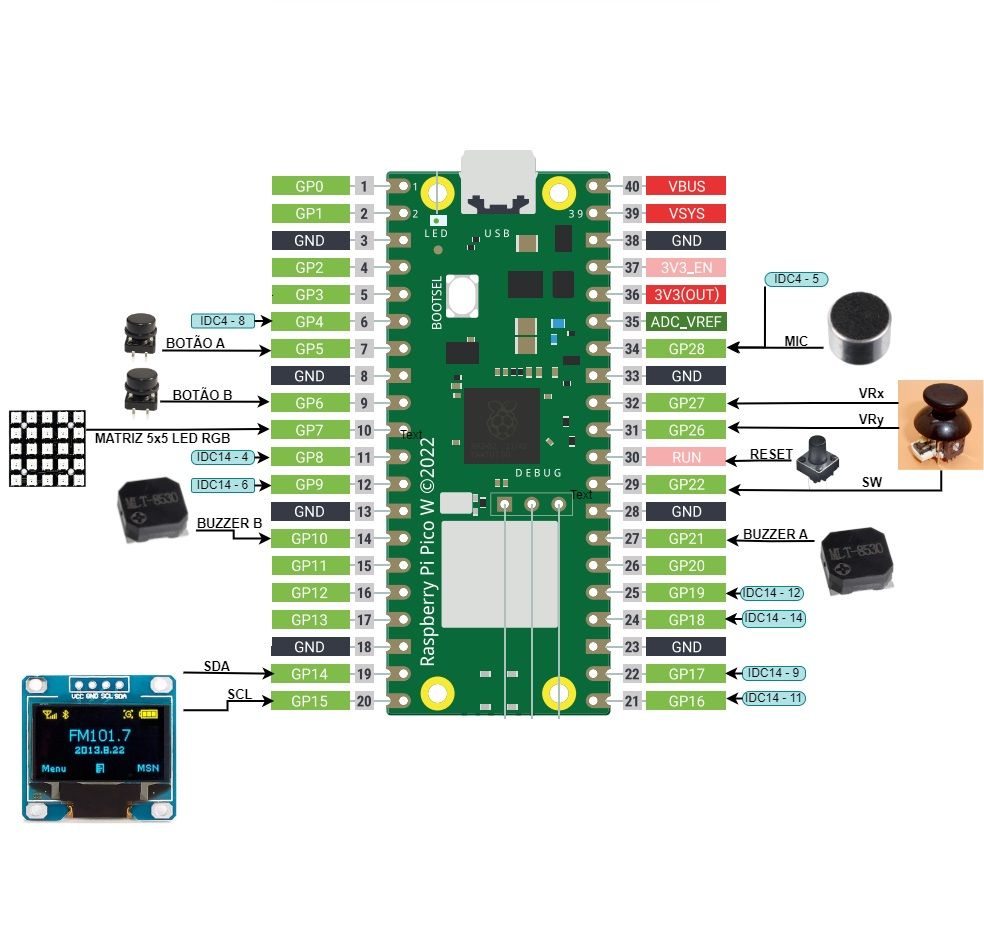
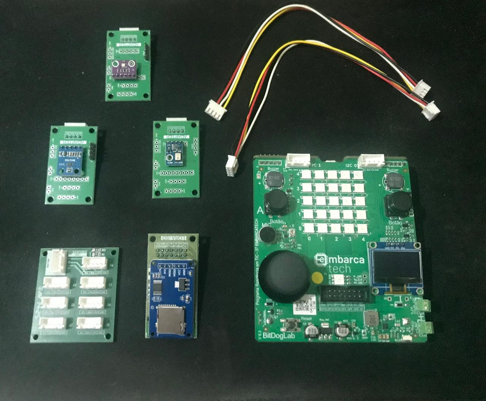

# 🌾 Projeto: Estação Meteorológica Portátil Agroclimática

## 🎯 Objetivo do Projeto

Desenvolver uma estação meteorológica portátil baseada na plataforma **BitDogLab**, com sensores ambientais, para monitorar as condições climáticas na área de plantação do avô do estudante, localizada no interior da Bahia. A estação registrará dados como temperatura, umidade, pressão atmosférica e luminosidade ao longo do tempo, possibilitando análises sazonais e tomadas de decisão mais precisas para a agricultura.

---

## 🛠️ Problema a Ser Resolvido

Produtores rurais de pequeno porte geralmente não têm acesso a dados meteorológicos locais precisos e contínuos. Essa limitação compromete o planejamento agrícola, principalmente em relação ao plantio, irrigação e colheita. Uma solução portátil e de baixo custo para coleta e visualização de dados ambientais pode trazer benefícios diretos ao desempenho e sustentabilidade da produção.

---

## ⚙️ Requisitos do Sistema

### ✅ Requisitos Funcionais

- Medir periodicamente:
  - 🌡️ Temperatura e 💧 Umidade do ar com o sensor **AHT10**;
  - 🌬️ Pressão atmosférica com o sensor **BMP280**;
  - ☀️ Nível de luminosidade com o sensor **BH1750**.
- Exibir os dados no display **OLED**.
- Navegar entre as variáveis usando os **botões A e B** da placa BitDogLab.
- Armazenar os dados lidos em um arquivo no cartão **SD Card** no formato `.CSV`.
- Indicar o status atual de coleta no display (ex.: "Coletando dados...", "Erro de leitura", etc).

### 🚫 Requisitos Não Funcionais

- O sistema deve ser **portátil** e operável em campo, utilizando uma fonte USB ou power bank.
- A coleta de dados deve ocorrer de forma **autônoma** (sem necessidade de conexão a computador).
- O projeto deve ser **simples de operar**, mesmo por usuários sem conhecimento técnico.
- O consumo de energia deve ser **otimizado** para permitir longos períodos de operação contínua.

---

## 📦 Lista de Materiais

| Componente                  | Função                                        |
|----------------------------|-----------------------------------------------|
| BitDogLab (RP2040 + Wi-Fi) | Microcontrolador principal                    |
| Sensor AHT10               | Medição de temperatura e umidade              |
| Sensor BMP280              | Medição de pressão atmosférica                |
| Sensor BH1750              | Medição de luminosidade ambiente              |
| Display OLED SSD1306       | Exibição dos dados                            |
| Cartão SD + Adaptador      | Armazenamento local dos dados coletados       |
| Botões A e B               | Navegação no menu de leitura (já na placa)    |
| Protoboard + jumpers       | Conexão entre sensores e microcontrolador     |
| Fonte USB / Power bank     | Alimentação portátil (Bateria ou Solar)       |
| Extensor I2C Placa         | Aumentar a Capacidade de Adicionar sensores   |
| Caixa plástica (opcional)  | Proteção da eletrônica em campo               |

## 📷 Portas da Raspberry Pi Pico W

---

## 📷 Placa Conectores e Sensores

---

## 🗓️ Entregável da Etapa 1

- Documento de definição de requisitos e materiais.
- Base para construção da arquitetura e modelagem na Etapa 2.

---

**Aluno:** Rafael Florentino Barbosa  
**Curso:** EmbarcaTech 2025  
**Instituição:** EmbarcaTech / HBr  
**Data:** 16 de julho de 2025
