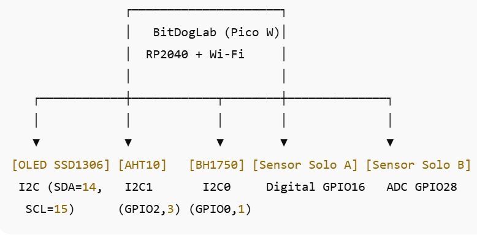
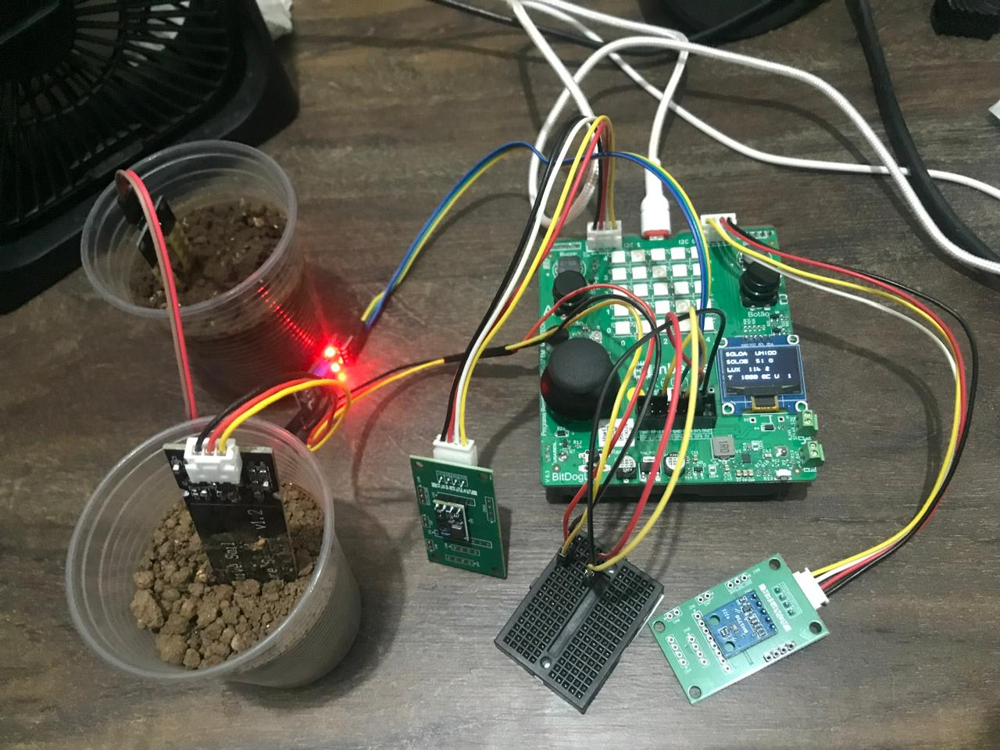
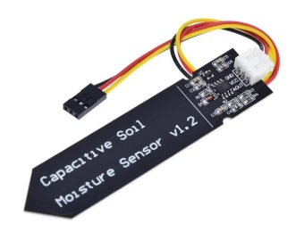
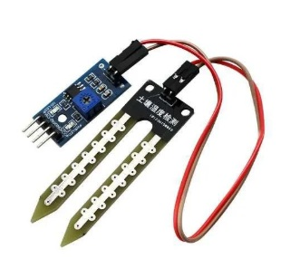
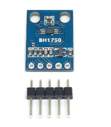
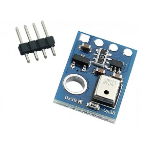
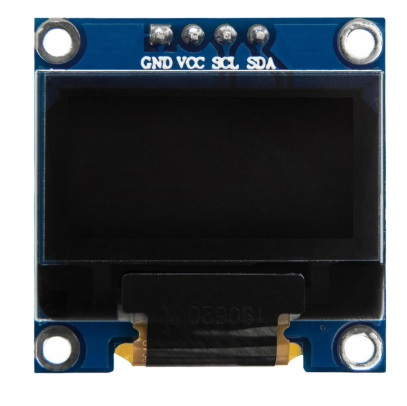
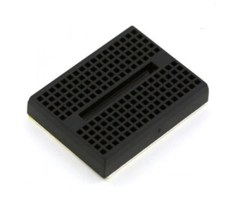

# 🌱 Projeto: Monitor Ambiental com BitDogLab Etapa3

## 🎯 Objetivo do Projeto  

Desenvolver um sistema embarcado utilizando a **BitDogLab (Raspberry Pi Pico W)** para monitoramento ambiental em tempo real.  
O sistema coleta informações de **umidade do solo (digital e capacitivo), luminosidade (BH1750) e temperatura/umidade do ar (AHT10)**, exibindo os dados tanto no **terminal serial** quanto no **display OLED SSD1306**. E futuramente os dados serão enviados via Wifi para um painel web interativo, Também será impressa em uma impressora 3D um recipiente em formato de ciaxa para a placa e os sensores ficarem alocados e protegidos, de sol, chuva e poeira. 

---

## 🛠️ Problema a Ser Resolvido  

Produtores agrícolas e estudantes de tecnologia necessitam de ferramentas de **baixo custo e portáteis** para monitorar condições ambientais locais.  
Esse sistema fornece informações básicas mas relevantes para **manejo de irrigação, controle de luminosidade e microclima**, podendo servir como base para uma estação IoT no futuro.  

---

## ⚙️ Requisitos do Sistema  

### ✅ Requisitos Funcionais  

- Medir periodicamente:  
  - 🌡️ **Temperatura e Umidade do ar** com o sensor **AHT10**;  
  - 💧 **Umidade do Solo A** com sensor **digital (DO)**;  
  - 💧 **Umidade do Solo B** com sensor **capacitivo (via ADC)**;  
  - ☀️ **Luminosidade ambiente** com o sensor **BH1750**.  
- Exibir os dados em **tempo real** no **OLED SSD1306** em até 4 linhas.  
- Registrar os valores no **terminal serial** para debug e acompanhamento.  

### 🚫 Requisitos Não Funcionais  

- O sistema deve ser **portátil**, alimentado por USB ou power bank.  
- Interface de uso deve ser **simples e direta** (sem menus complexos).  
- Leitura dos sensores deve ser **confiável e com filtragem básica** (ex.: média no ADC do solo capacitivo).  

---

## 📦 Lista de Materiais  

| Componente                  | Função                                        |
|-----------------------------|-----------------------------------------------|
| BitDogLab (RP2040 + Wi-Fi)  | Microcontrolador principal                    |
| Sensor AHT10                | Medição de temperatura e umidade do ar        |
| Sensor BH1750               | Medição de luminosidade ambiente              |
| Sensor de Solo Digital (A)  | Detecção binária de solo úmido/seco           |
| Sensor de Solo Capacitivo (B)| Medição analógica de umidade do solo         |
| Display OLED SSD1306        | Exibição das leituras em tempo real           |
| Protoboard + Jumpers        | Conexão entre sensores e microcontrolador     |
| Fonte USB / Power Bank      | Alimentação portátil                          |

---

## 📂 Estrutura do Código  
```  
├── app/
│ └── main.c # Programa principal
├── drivers/
│ ├── ssd1306.c # Driver OLED SSD1306
│ ├── ssd1306.h
│ ├── ssd1306_i2c.c
│ ├── ssd1306_i2c.h
│ └── ssd1306_font.h
├── hal/
│ ├── air.c # Leitura AHT10
│ ├── light.c # Leitura BH1750
│ ├── soloA.c # Solo digital
│ ├── soloB.c # Solo capacitivo
│ └── display.c # Funções do display OLED
├── include/
│ ├── air.h
│ ├── light.h
│ ├── soloA.h
│ ├── soloB.h
│ └── display.h
├── CMakeLists.txt
└── README.md
```  
---

## 📊 Funcionamento  

- A cada ciclo (2 segundos):  
  - Lê os sensores de **solo A (digital)**, **solo B (capacitivo, média 30 amostras)**, **luminosidade (BH1750)** e **ar (AHT10)**.  
  - Exibe os valores no terminal serial:  

    ```
    SoloA: Umido | SoloB: 58.0% | Lux: 107.5 | T:25.0C U:43.6%
    ```  

  - Atualiza o **OLED SSD1306** em 4 linhas:  
    ```
    SoloA: Umido
    SoloB: 58.0%
    Lux: 107.5
    T:25.0C U:43.6%
    ```  

---

## 🗓️ Entregável Anterior Etapa2

### 🏗️ 1. Arquitetura de Hardware



- OLED SSD1306 → exibição dos dados em 4 linhas.
- AHT10 → temperatura e umidade do ar via I²C1.
- BH1750 → luminosidade via I²C0.
- Sensor Solo A → umidade do solo digital (seco/úmido) no GPIO16.
- Sensor Solo B → umidade do solo capacitivo via ADC no GPIO28.
- BitDogLab (Pico W) → processamento, integração de sensores e futura conexão Wi-Fi.

### 🧩 2. Blocos Funcionais


### 🔄 3. Fluxograma do Software


- Código modularizado em **app**, **hal**, **drivers** e **include**.  
- Sistema já funcionando com captura e exibição de dados em **display OLED** e **terminal serial**.  
- Base pronta para futura integração com **Wi-Fi (HTTP/MQTT)** e **armazenamento externo (SD ou nuvem)**.  


---

## 🗓️ Entregável Atual Etapa3

# 🚀 Etapa 3 – Protótipo Funcional, Testes e Ajustes

## 🔧 Construção do Protótipo  

O protótipo foi construído utilizando a **placa BitDogLab (Raspberry Pi Pico W)**, conectada aos sensores e ao display OLED SSD1306 conforme o diagrama de hardware da Etapa 2.  

- **Conexões principais**:  
  - **I²C0** → BH1750 (luminosidade)  
  - **I²C1** → AHT10 (temperatura/umidade) + SSD1306 (display)  
  - **GPIO16** → Sensor de solo digital (Solo A)  
  - **GPIO28 (ADC2)** → Sensor de solo capacitivo (Solo B)  

O código foi implementado de forma **modular**, seguindo a arquitetura de camadas (drivers, HAL, aplicação).  

---

## 🧪 Testes Realizados  

Os testes foram divididos em três fases:  

### 1. **Teste de Inicialização**  
- Objetivo: validar se todos os periféricos inicializam corretamente.  
- Resultado: inicialização correta de UART (Serial), I²C (sensores + display), GPIO (Solo A) e ADC (Solo B).  

### 2. **Teste de Aquisição de Dados**  
- Objetivo: verificar se os valores dos sensores estão sendo coletados de forma coerente.  
- Resultados:  
  - **AHT10** → leituras de temperatura e umidade estáveis, com pequenas variações de 0,2 °C e 0,5 %UR entre ciclos.  
  - **BH1750** → variação de lux conforme iluminação ambiente (ex.: 10–20 lux em ambiente fechado, >200 lux sob luz direta).  
  - **Solo A (digital)** → mudança clara entre “Úmido” e “Seco”.  
  - **Solo B (capacitivo)** → variação percentual coerente entre 20 % (solo úmido) e 80 % (solo seco).  

### 3. **Teste de Exibição**  
- Objetivo: validar a exibição dos dados no display OLED e no terminal Serial.  
- Resultados:  
  - **Serial** mostra dados formatados em linha única:  
    ```
    SoloA: Umido | SoloB: 58.0% | Lux: 107.5 | T:25.0C U:43.6%
    ```
  - **OLED SSD1306** apresenta dados em 4 linhas:  
    ```
    SoloA: Umido
    SoloB: 58.0%
    Lux: 107.5
    T:25.0C U:43.6%
    ```

---

## 📝 Ajustes Necessários para Versão Final  

Durante os testes, foram observados pontos de melhoria:  

1. **Filtragem de Sinais Analógicos**  
   - O sensor de solo capacitivo (Solo B) ainda apresenta pequenas oscilações.  
   - Ajuste: implementar **filtro de média móvel** ou **exponencial** para leituras mais estáveis.  

2. **Padronização das Unidades**  
   - Atualmente as leituras estão sem limite de casas decimais.  
   - Ajuste: limitar a 1 casa decimal para facilitar a leitura no display.  

3. **Gestão de Atualização no OLED**  
   - A tela pisca levemente a cada atualização.  
   - Ajuste: usar **atualização seletiva** (só sobrescrever o necessário, ao invés de limpar tudo).  

4. **Documentação de Pinos**  
   - Nem todos os pinos usados estão listados no cabeçalho do código.  
   - Ajuste: criar um **arquivo `pins.h`** centralizando definições de GPIOs.  

5. **Integração Wi-Fi (Etapa futura)**  
   - O protótipo atual só mostra dados localmente.  
   - Ajuste: adicionar módulo para envio via **HTTP/MQTT** em próxima versão.  

---

✅ **Conclusão da Etapa 3**:  
O protótipo está **funcional e validado** em ambiente real, cumprindo todos os requisitos definidos.  
Os ajustes listados visam **melhorar a robustez, clareza e escalabilidade** do sistema antes da entrega final.  

# ⚠️ Desafios Encontrados e 🔧 Melhorias Planejadas

## 📌 Desafios Encontrados

1. **Integração dos Sensores via I²C**  
   - O barramento I²C foi compartilhado entre múltiplos dispositivos (AHT10 e OLED no I²C1, BH1750 no I²C0).  
   - Desafio: conflitos de endereço e inicialização simultânea.  
   - Solução aplicada: separação em dois canais I²C independentes e inicialização sequencial dos dispositivos.  

2. **Ruído nas Leituras do Sensor de Solo Capacitivo (Solo B)**  
   - O ADC apresentou pequenas oscilações devido a ruídos elétricos e variações de alimentação.  
   - Solução temporária: média aritmética de N amostras.  
   - Problema: ainda há variação perceptível entre leituras consecutivas.  

3. **Piscar do Display OLED a Cada Atualização**  
   - O método atual limpa toda a tela antes de escrever os novos dados.  
   - Resultado: leve flicker visível para o usuário.  

4. **Leituras Iniciais Instáveis (AHT10 e BH1750)**  
   - Nos primeiros ciclos de leitura, os sensores retornam valores incorretos ou nulos.  
   - Solução: descartar as 3 primeiras leituras de cada sensor.  

5. **Consumo de Energia**  
   - O protótipo permanece sempre ligado, sem modos de economia.  
   - Impacto: autonomia limitada quando usado em power bank.  

---

## 🚀 Melhorias Planejadas

1. **Filtro Digital Avançado para ADC**  
   - Implementar **média móvel exponencial** ou **filtro de Kalman** para suavizar leituras do Solo B.  

2. **Atualização Parcial no OLED**  
   - Alterar driver gráfico para **reescrever apenas linhas alteradas**, eliminando o efeito de piscar.  

3. **Gerenciamento de Energia**  
   - Uso de modos de economia da Pico W:  
     - Reduzir clock em idle.  
     - Colocar sensores em modo sleep entre leituras.  
     - Ciclos de coleta configuráveis (ex.: a cada 1 min, 5 min).  

4. **Interface de Usuário Melhorada**  
   - Uso dos **botões A e B** para alternar entre telas (solo, ar, luz).  
   - Exibição de ícones simples no display (gota 💧, sol ☀️, termômetro 🌡️).  

5. **Integração com Wi-Fi**  
   - Envio dos dados para servidor MQTT ou API REST.  
   - Possibilidade de monitoramento remoto via aplicativo ou dashboard web.  

6. **Armazenamento Local no SD Card**  
   - Salvar leituras periódicas em formato `.CSV` para análise posterior.  

---

✅ **Resumo**:  
Os principais desafios encontrados foram relacionados à **estabilidade das leituras** e à **interface de exibição**.  
As melhorias planejadas visam tornar o sistema mais **confiável, eficiente e escalável**, preparando terreno para a futura integração com **IoT e análise em nuvem**. 

## 📷 Protótipo



## Sensores

###  Sensor Capacitivo de Umidade do Solo V1.2 - com Regulador



### Módulo Sensor De Umidade De Solo 3,3-5V - LM393


### Módulo Sensor De Luminosidade BH1750 - GY-302


### Módulo Sensor de Temperatura e Umidade de Alta Precisão - AHT10


### Tela OLED SSD1306 0.96


### Mini Protoboard 170 pontos

---

**Aluno:** Rafael Florentino Barbosa  
**Curso:** EmbarcaTech 2025  
**Instituição:** EmbarcaTech / HBr  
**Data:** 22 de agosto de 2025 